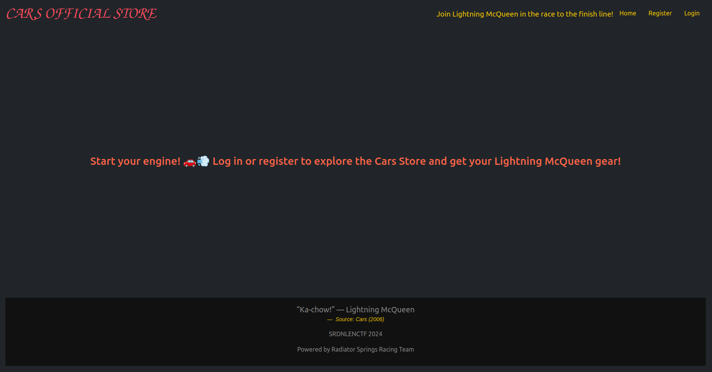
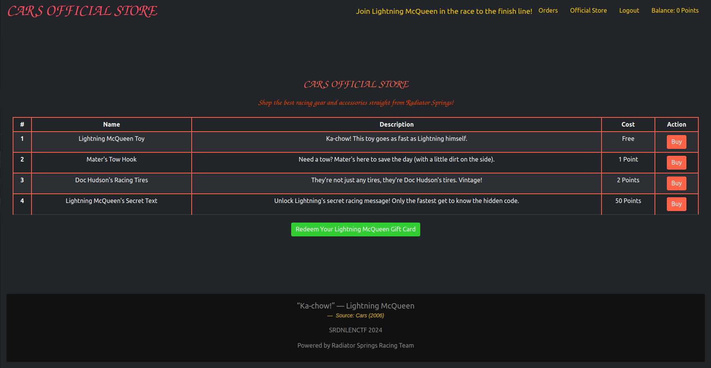
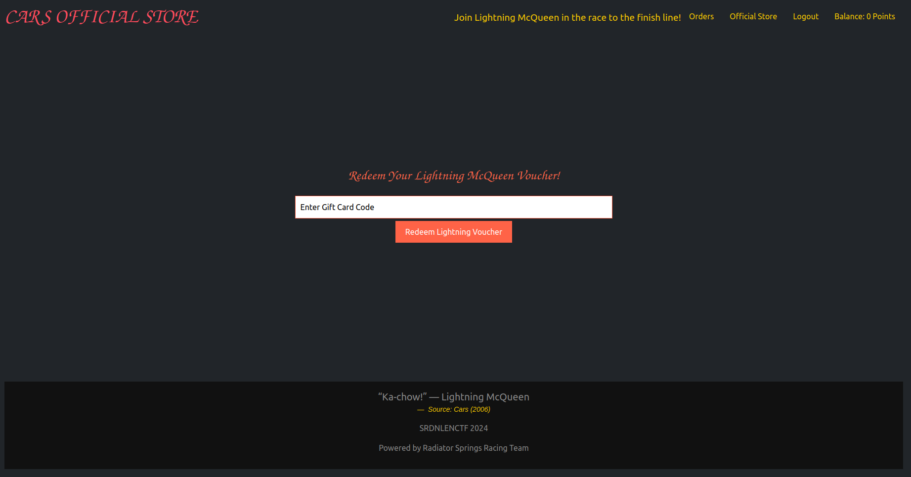
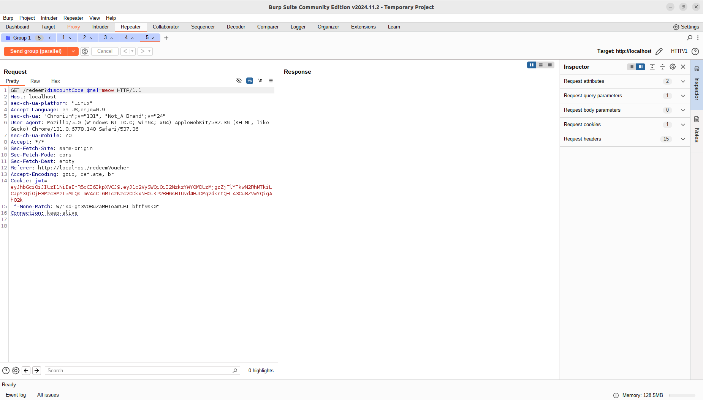
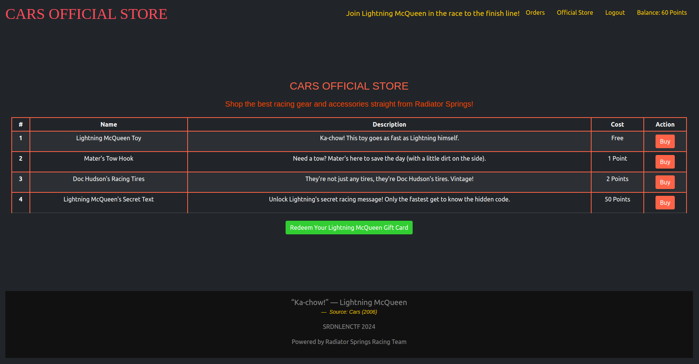

The main page ask you to register an account. Once it 's done you can access the store that contains four items to buy. Among these items, one costs 50 points and is the flag.





One problem is, our balance is set to 0. However, there is a way to gain points and that is to redeem a voucher. But again, we don't which code we need to enter.



Looking at the source code for the `/redeem` endpoint, we can make the conclusion of three things on the voucher code:

- The voucher code is generated randomly and we cannot brute-force it 
- Its value is only 20 points
- You can redeem it only once

```js
//app.js
const generateDiscountCode = () => {
    const characters = 'ABCDEFGHIJKLMNOPQRSTUVWXYZ0123456789';
    let discountCode = '';
    for (let i = 0; i < 12; i++) {
        discountCode += characters.charAt(Math.floor(Math.random() * characters.length));
    }
    return discountCode;
};

//[...]
const createDiscountCodes = async () => {
        const discountCodes = [
            { discountCode: generateDiscountCode(), value: 20 }
        ];
//[...]
```


```js
//routes.js
router.get('/redeem', isAuth, async (req, res) => {
    try {
        const user = await User.findById(req.user.userId);

        if (!user) {
            return res.render('error', { Authenticated: true, message: 'User not found' });
        }

        // Now handle the DiscountCode (Gift Card)
        let { discountCode } = req.query;
        
        if (!discountCode) {
            return res.render('error', { Authenticated: true, message: 'Discount code is required!' });
        }

        const discount = await DiscountCodes.findOne({discountCode})

        if (!discount) {
            return res.render('error', { Authenticated: true, message: 'Invalid discount code!' });
        }

        // Check if the voucher has already been redeemed today
        const today = new Date();
        const lastRedemption = user.lastVoucherRedemption;

        if (lastRedemption) {
            const isSameDay = lastRedemption.getFullYear() === today.getFullYear() &&
                              lastRedemption.getMonth() === today.getMonth() &&
                              lastRedemption.getDate() === today.getDate();
            if (isSameDay) {
                return res.json({success: false, message: 'You have already redeemed your gift card today!' });
            }
        }

        // Apply the gift card value to the user's balance
        const { Balance } = await User.findById(req.user.userId).select('Balance');
        user.Balance = Balance + discount.value;
        // Introduce a slight delay to ensure proper logging of the transaction 
        // and prevent potential database write collisions in high-load scenarios.
        new Promise(resolve => setTimeout(resolve, delay * 1000));
        user.lastVoucherRedemption = today;
        await user.save();
//[...]
```

You may already have spotted it but there is a problem with the way the code is handled. Indeed, there was no form of sanitization before running this line of code : `DiscountCodes.findOne({discountCode})`. Thus, this leads to nosql injection as we can control `discountCode` parameter. For example, we could send `discountCode[$ne]=meow` and it would work.
Moreover, we can guess from the title of the chall and the code that a race condition attack is needed to exploit the application. Since, the voucher code makes us gain 20 points, we need to validate it 3 times.

Using burp suite, I intercepted the request leading to `/redeem`, made a nosql injection and duplicate this request in group tab of burp suite repeater to perform the race condition attack. Once done, I sent all the requests in parallel.





Now, we have enough points to buy the flag :

