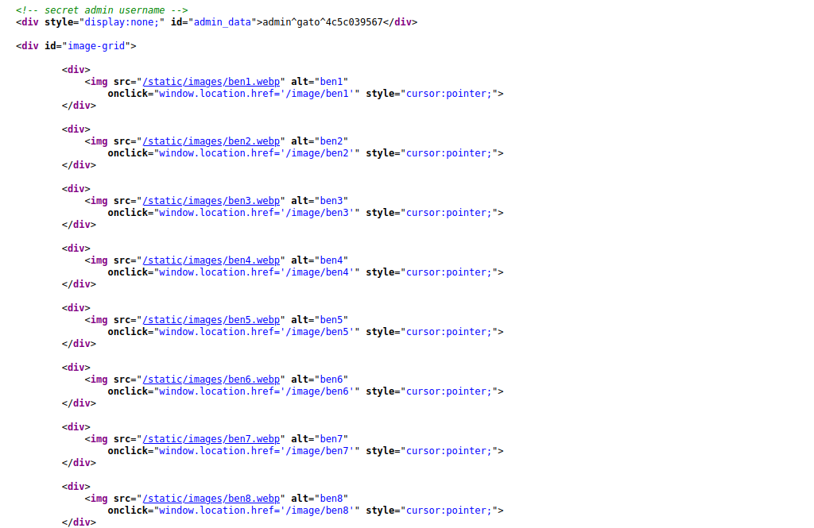
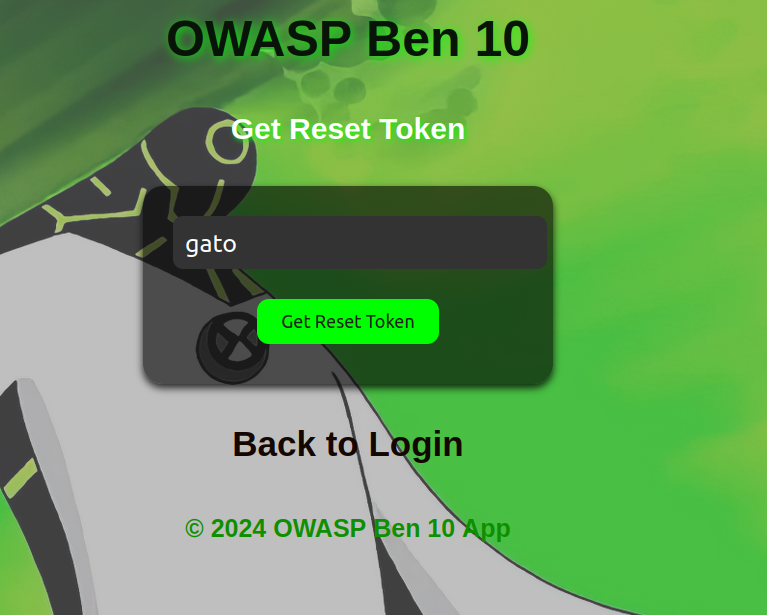
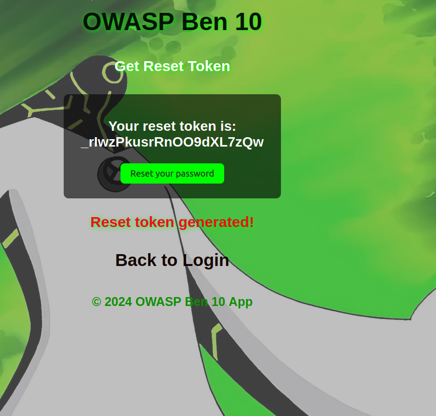
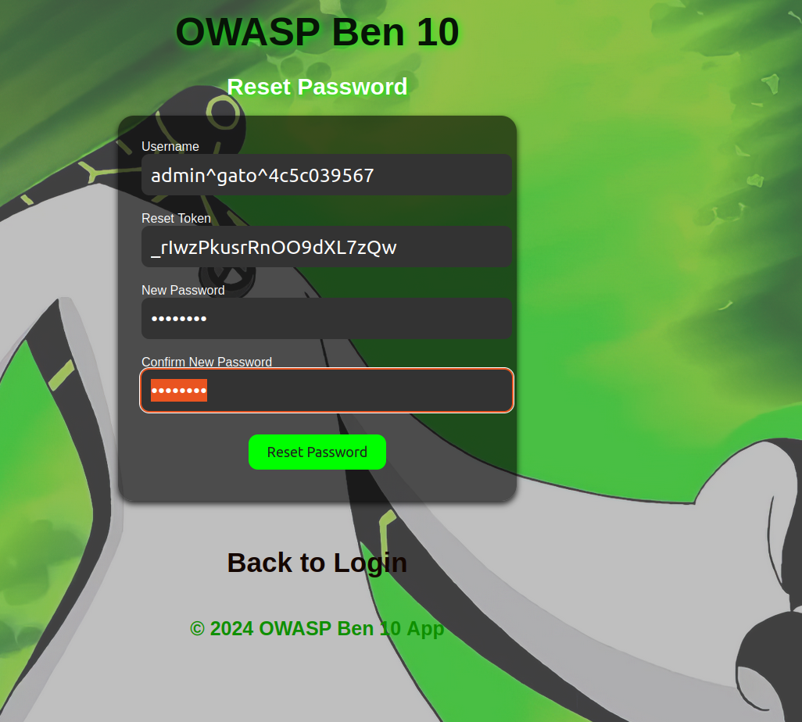
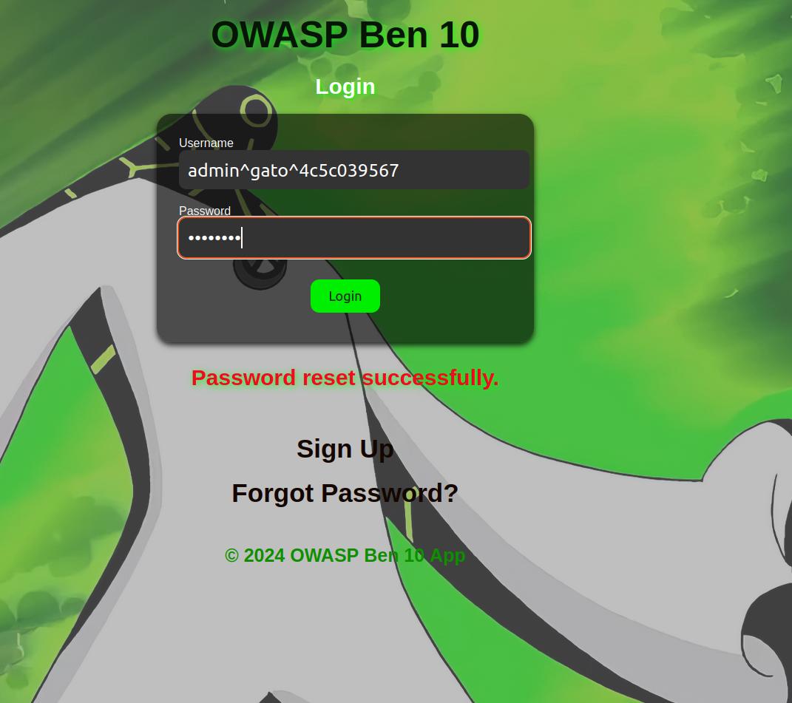
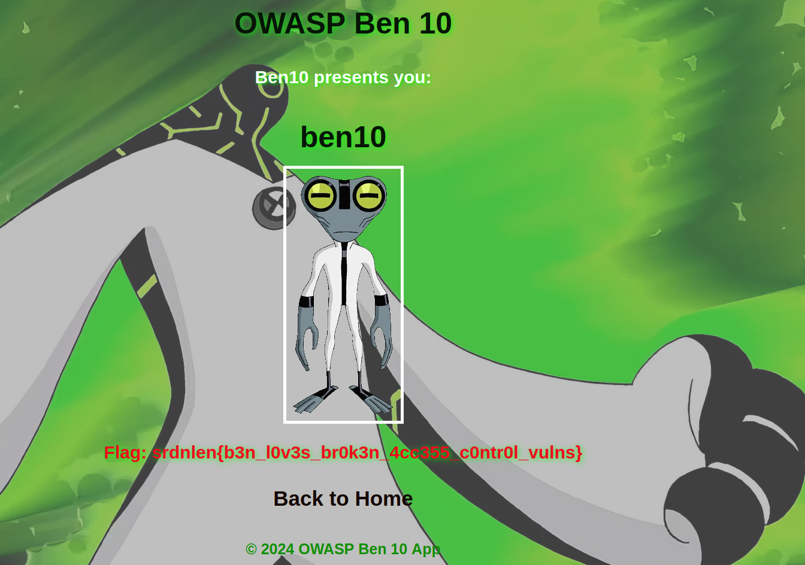

When acessing the website, you are redirected to a login page. There, you can chose to sign up, login, or reset your password


Once you are logged in, you are greeted with this page :


In order to get the flag, we need to access the last page which is `/image/ben10` with `admin` inside our username.


```python
@app.route('/image/<image_id>')
def image(image_id):
    """Display the image if user is admin or redirect with missing permissions."""
    if 'username' not in session:
        return redirect(url_for('login'))

    username = session['username']

    if image_id == 'ben10' and not username.startswith('admin'):
        return redirect(url_for('missing_permissions'))

    flag = None
    if username.startswith('admin') and image_id == 'ben10':
        flag = FLAG

    return render_template('image_viewer.html', image_name=image_id, flag=flag)
```

However, we can't register with a username containing `admin`.
This snippet code show us that an admin account is created at the same time than creating an account.

```python
@app.route('/register', methods=['GET', 'POST'])
def register():
    """Handle user registration."""
    if request.method == 'POST':
        username = request.form['username']
        password = request.form['password']

        if username.startswith('admin') or '^' in username:
            flash("I don't like admins", "error")
            return render_template('register.html')

        if not username or not password:
            flash("Both fields are required.", "error")
            return render_template('register.html')

        admin_username = f"admin^{username}^{secrets.token_hex(5)}"
        admin_password = secrets.token_hex(8)

        try:
            conn = sqlite3.connect(DATABASE)
            cursor = conn.cursor()
            cursor.execute("INSERT INTO users (username, password, admin_username) VALUES (?, ?, ?)",
                           (username, password, admin_username))
            cursor.execute("INSERT INTO users (username, password, admin_username) VALUES (?, ?, ?)",
                           (admin_username, admin_password, None))
            conn.commit()
        except sqlite3.IntegrityError:
            flash("Username already exists!", "error")
            return render_template('register.html')
        finally:
            conn.close()

        flash("Registration successful!", "success")
        return redirect(url_for('login'))

    return render_template('register.html')
```

We need to get this admin username. Looking at the source code, we can see that it is reflected.



We still need the password though. Looking at the code for the `/reset-password` endpoint, we can see that it refuses to change the password for admin users.

```python
@app.route('/reset_password', methods=['GET', 'POST'])
def reset_password():
    """Handle reset password request."""
    if request.method == 'POST':
        username = request.form['username']

        if username.startswith('admin'):
            flash("Admin users cannot request a reset token.", "error")
            return render_template('reset_password.html')

        if not get_user_by_username(username):
            flash("Username not found.", "error")
            return render_template('reset_password.html')

        reset_token = secrets.token_urlsafe(16)
        update_reset_token(username, reset_token)

        flash("Reset token generated!", "success")
        return render_template('reset_password.html', reset_token=reset_token)

    return render_template('reset_password.html')
```
However, looking at the code for resetting our password, we can see that it makes no distinction between the actual username and the admin username.

```python
@app.route('/forgot_password', methods=['GET', 'POST'])
def forgot_password():
    """Handle password reset."""
    if request.method == 'POST':
        username = request.form['username']
        reset_token = request.form['reset_token']
        new_password = request.form['new_password']
        confirm_password = request.form['confirm_password']

        if new_password != confirm_password:
            flash("Passwords do not match.", "error")
            return render_template('forgot_password.html', reset_token=reset_token)

        user = get_user_by_username(username)
        if not user:
            flash("User not found.", "error")
            return render_template('forgot_password.html', reset_token=reset_token)

        if not username.startswith('admin'):
            token = get_reset_token_for_user(username)
            if token and token[0] == reset_token:
                update_password(username, new_password)
                flash(f"Password reset successfully.", "success")
                return redirect(url_for('login'))
            else:
                flash("Invalid reset token for user.", "error")
        else:
            username = username.split('^')[1] # actual username
            token = get_reset_token_for_user(username)
            if token and token[0] == reset_token:
                update_password(request.form['username'], new_password)
                flash(f"Password reset successfully.", "success")
                return redirect(url_for('login'))
            else:
                flash("Invalid reset token for user.", "error")

    return render_template('forgot_password.html', reset_token=request.args.get('token'))
```
Meaning, we can ask for a reset token with our actual username, demand to reset the admin username password and it will work :









