# Enumeration

As always, the first step is to scan the machine's ports.

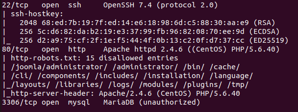

On the website, I found a robots.txt file containing an endpoint to an administrator login form.

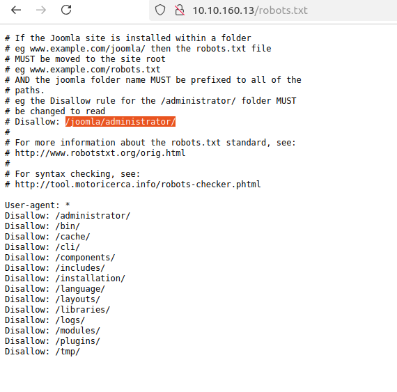

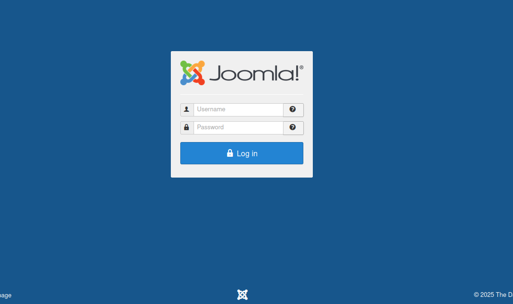

# CMS version number
Searching for configuration files, I discovered that Joomla's configuration endpoint is located at `/administrator/manifests/files/joomla.xml`.

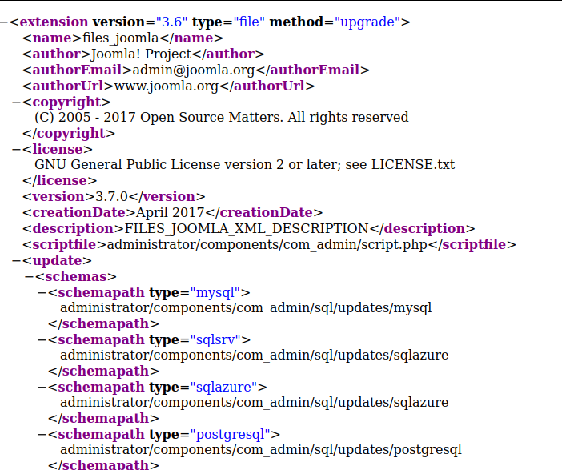

To identify the full version number, I looked at this and guessed this was the latest version:

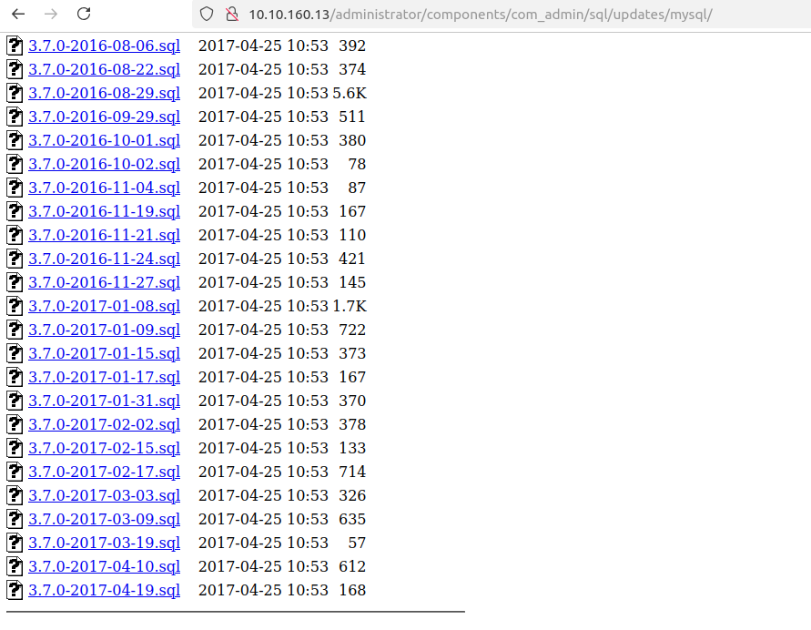

# SQLI

With this, I had an email address `admin@joomla.org` and a version number. Searching for CVEs on joomla, I found this one https://www.exploit-db.com/exploits/42033 and tested it:

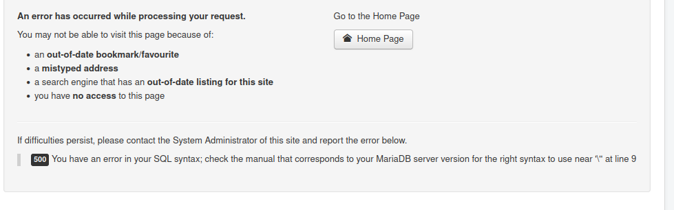

It worked! The exploit even includes the syntax to run sqlmap, so I used the tool to dump the db. After a while, I retrieved a password hash `$2y$10$0veO/JSFh4389Lluc4Xya.dfy2MF.bZhz0jVMw.V.d3p12kBtZutm` with the username `jonah`.

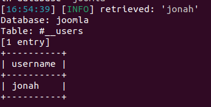

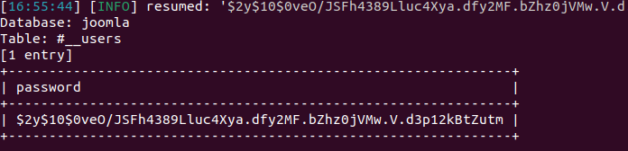

I used Hashcat to crack the hash and recovered the password: `spiderman123`. I tried using these credentials to log in via SSH, but it didn’t work. However, I could access the administrator panel.

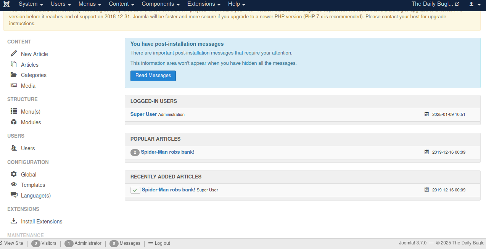

There was on the administrator panel a template editor where it is possible to write php code. I used this to upload a php reverse shell.

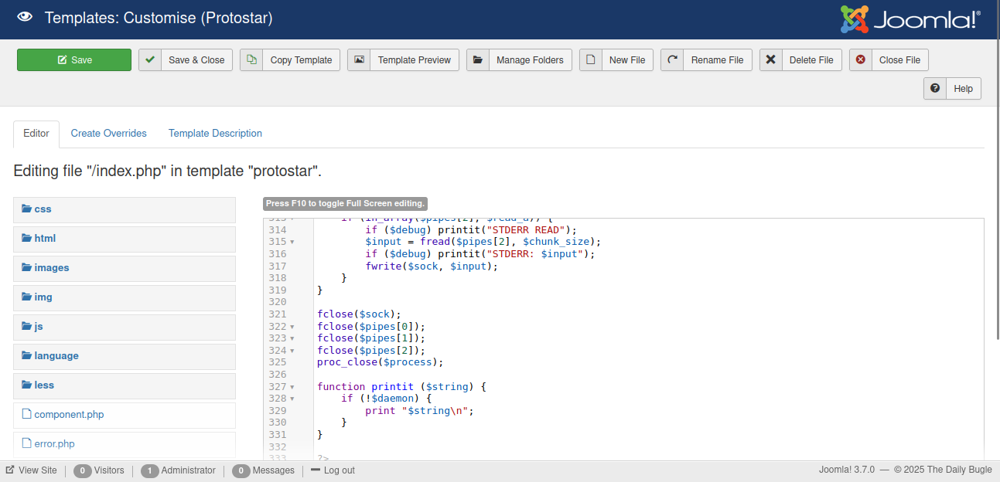

After executing the reverse shell, I gained access and stabilized my shell.

# User flag

Inspecting at the configuration.php file, I found credentials for the root user. I tested them but they didn't work. However, there was a second user on this machine, `jjameson`, maybe the credentials could work for him ?

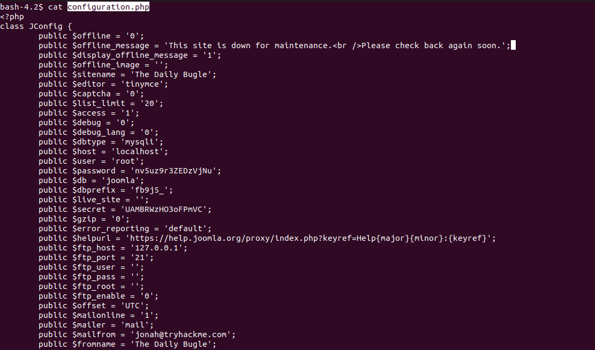

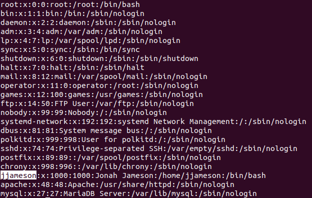

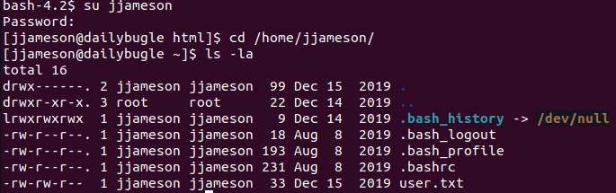

# Root flag

The next step was to check if I could execute commands with `sudo` without providing a password. Most of the time, this is not as easy but in this case, it worked.

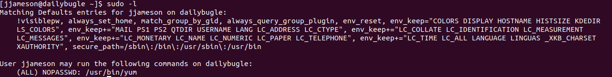

So, yum can be used. But how ? From https://gtfobins.github.io/gtfobins/yum/ I saw that I could spawn a shell with this command. In order to do that, I needed to run the following commands:

```bash
TF=$(mktemp -d)
cat >$TF/x<<EOF
[main]
plugins=1
pluginpath=$TF
pluginconfpath=$TF
EOF

cat >$TF/y.conf<<EOF
[main]
enabled=1
EOF

cat >$TF/y.py<<EOF
import os
import yum
from yum.plugins import PluginYumExit, TYPE_CORE, TYPE_INTERACTIVE
requires_api_version='2.1'
def init_hook(conduit):
  os.execl('/bin/sh','/bin/sh')
EOF

sudo yum -c $TF/x --enableplugin=y
```

Basically, what it does is create a plugin that runs a shell with the permissions of the runner. Since, I've used sudo I became root.

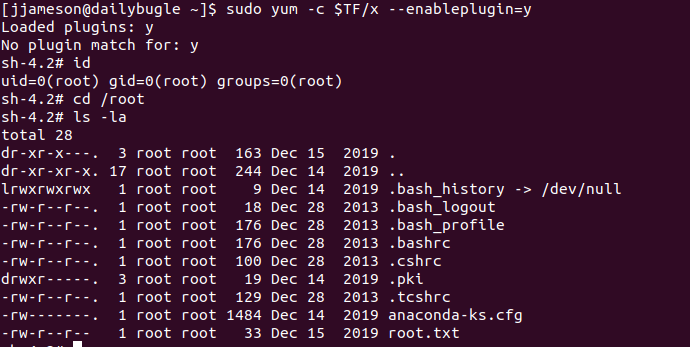
