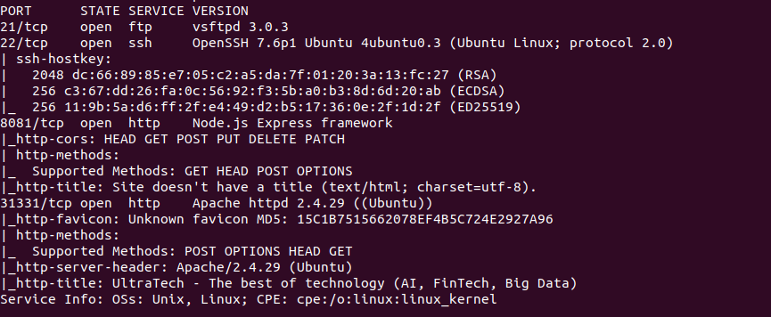
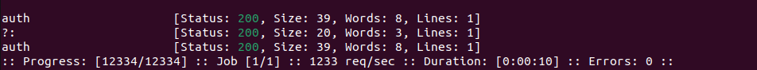
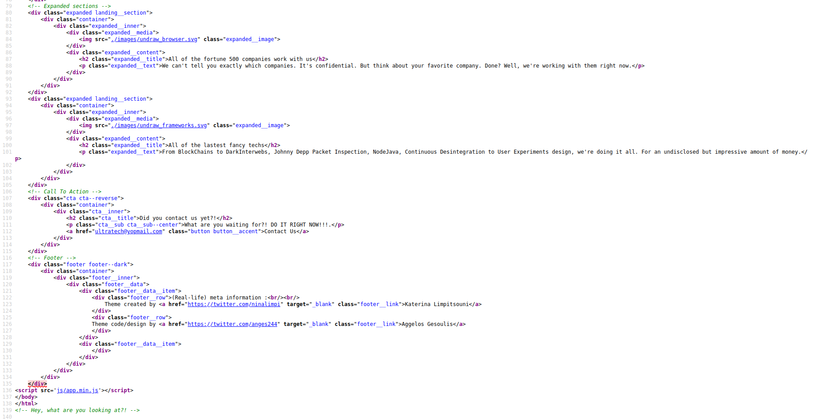
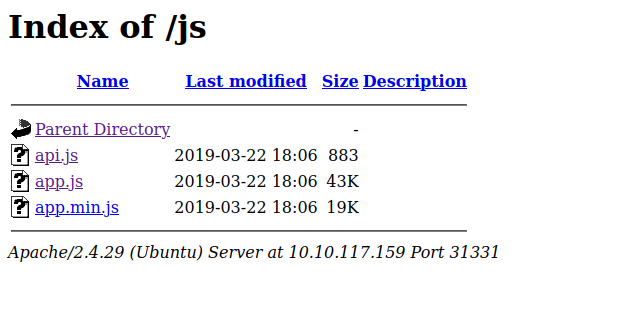
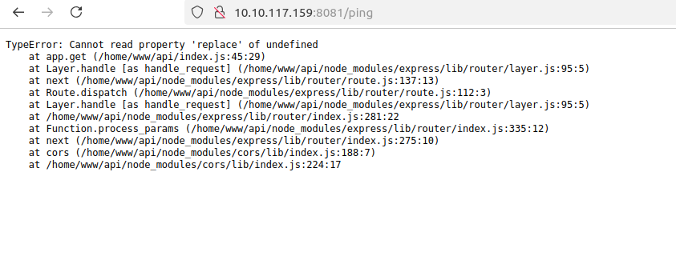
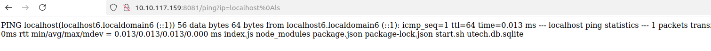
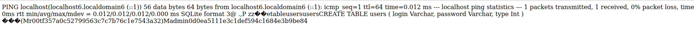
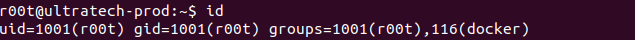
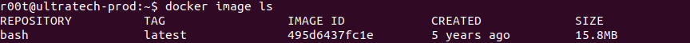
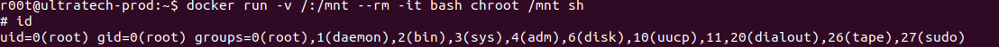

# Enumeration 

Scanning all ports with nmap, we get this result:

`nmap -sC -sV -oN ports.txt -v -p- 10.10.117.159`



From this scan alone, it is possible to answer to most of the questions:
- The port 8081 hosts a `Node.js` application
- The port `31331` runs an `Apache` server hosted on an `Ubuntu` OS.

Using ffuf to enumerate endpoints on the Node.js application:

`ffuf -u http://10.10.117.159:8081/FUZZ -w ~/pentest/wordlist/SecLists-master/Discovery/Web-Content/api/api-endpoints-res.txt -c`



So, there is a first endpoint which is a login service.

Let's take a look at the web page from the Apache server:


Looking at the source code, we can see  a directory:





The `app.js` was basic frontend JavaScript but the `api.js` file is a bit more interesting as it can help us answering the last question. Indeed, it references another endpoint: `/ping`

```js
(function() {
    console.warn('Debugging ::');

    function getAPIURL() {
	return `${window.location.hostname}:8081`
    }
    
    function checkAPIStatus() {
	const req = new XMLHttpRequest();
	try {
	    const url = `http://${getAPIURL()}/ping?ip=${window.location.hostname}`
	    req.open('GET', url, true);
	    req.onload = function (e) {
		if (req.readyState === 4) {
		    if (req.status === 200) {
			console.log('The api seems to be running')
		    } else {
			console.error(req.statusText);
		    }
		}
	    };
	    req.onerror = function (e) {
		console.error(xhr.statusText);
	    };
	    req.send(null);
	}
	catch (e) {
	    console.error(e)
	    console.log('API Error');
	}
    }
    checkAPIStatus()
    const interval = setInterval(checkAPIStatus, 10000);
    const form = document.querySelector('form')
    form.action = `http://${getAPIURL()}/auth`;
    
})();
```

This confirms that the application uses two endpoints: `/auth` and `/ping`.

# RCE

The /ping endpoint takes an argument: `ip`, and executes the ping command with it. Is there a way to trigger an rce ? Moreover, if the ip parameter is missing, the app crashes:



We can see from the error that it is using the replace function and effectively, when I tried to execute commands by using these characters `& ; |`, they were removed. Let's see from https://github.com/swisskyrepo/PayloadsAllTheThings/blob/master/Command%20Injection/README.md which technique could be employed. In this case, the new line character bypasses the filter:



There are 2 files `start.sh` and `utech.db.sqlite`. Nothing useful from the bash script but we can retrieve some credentials from the db file:



r00t:f357a0c52799563c7c7b76c1e7543a32
admin:0d0ea5111e3c1def594c1684e3b9be84

Let's try to crack the first hash by using hashcat the rockyou wordlist:

`hashcat -a 0 -m 0 rootHash.txt ~/pentest/wordlist/rockyou.txt`

We get this result: `f357a0c52799563c7c7b76c1e7543a32:n100906`

# root

Let's get in now. Remember the ports scan from before? There is an ssh port available, let's try to connect to it.

`ssh r00t@10.10.117.159`

By running the id command, we can see that the r00t user is part of the docker group.



We may use docker to spawn a shell with root privileges. Let's look at the images available:



From https://gtfobins.github.io/gtfobins/docker/, we can use the first command to spawn a shell. Replace the alpine image by the bash image and here we go !

