# Enumeration

Running Nmap, I discovered four open ports. Since ElBandito is a web-focused challenge, the ports 80 and 8080 are more interesting. Additionally, the server on port 80 uses HTTPS, which is worth noting.

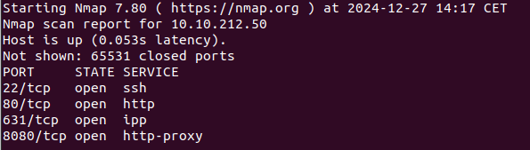


Using Wfuzz, I identified some pages on the server running on port 80 that might be worth to look at.
But before that, I checked the server on port 8080.
From the enumeration, it could be seen that the server uses the java spring framework. 
Many of endpoint are forbidden by default (Especially /admin-flag). 

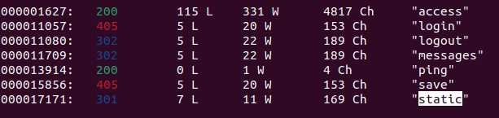

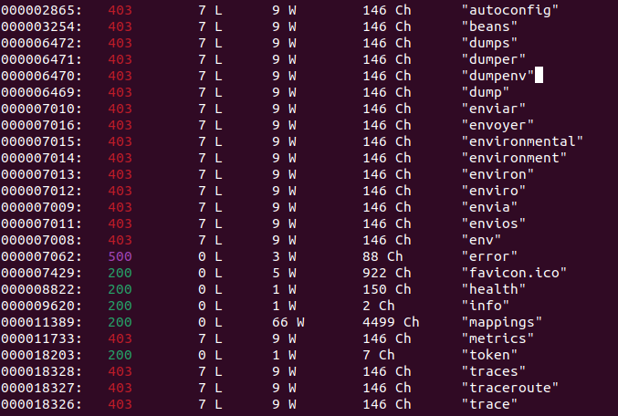

# The first flag

Diving into the website, I found a page where you can make a websocket connection.
However, the service didn't seem to work. 

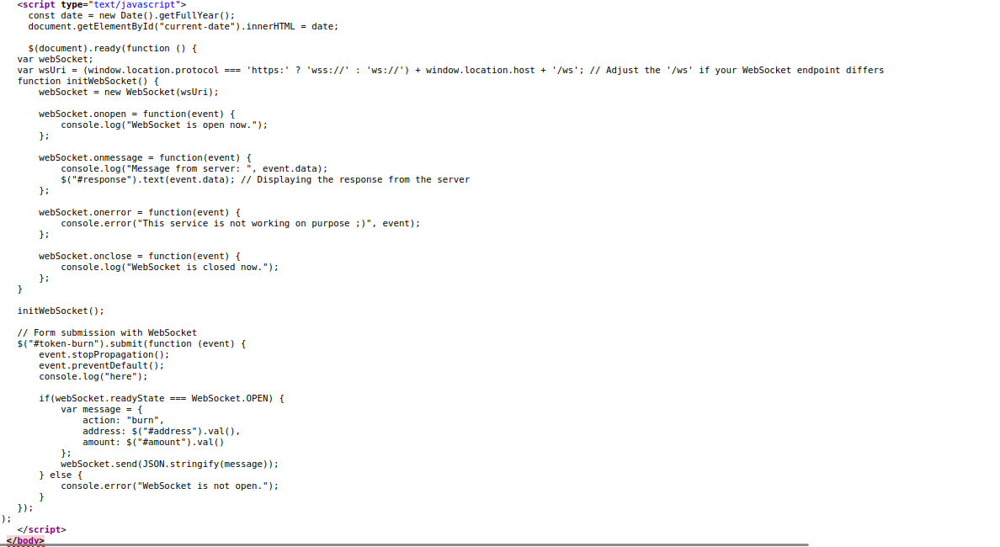

Taking the hint "smuggle all the flags" from the room, 
I guessed that a request smuggling attack was necessary.
For this, we need to use the webSocket protocol.
However, the websocket service is offline. Meaning that we, as the attacker, need to set up a fake webSocket connection between us and the server.

For the request, there are 3 important headers to write:
- Sec-WebSocket-Version: 13 (for valid connection) anything else (for invalid connection) 
- Upgrade: WebSocket
- Connection: Upgrade

The request should look something like this:

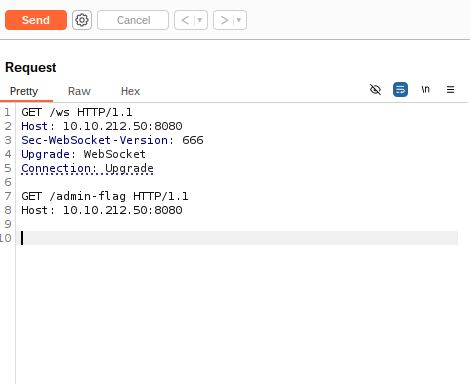

However, this didn't work. I guessed there were some kind of security attached to the proxy.
To bypass this protection, I needed to make a fake websocket connection between my websocket and the backend server.
For this, I needed to find a ssrf vulnerability and exploit it to make a request to a legitimate websocket (my own one).
While exploring the website, I came accross a `services.html` page.

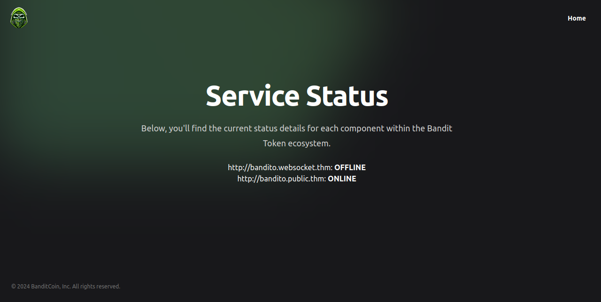

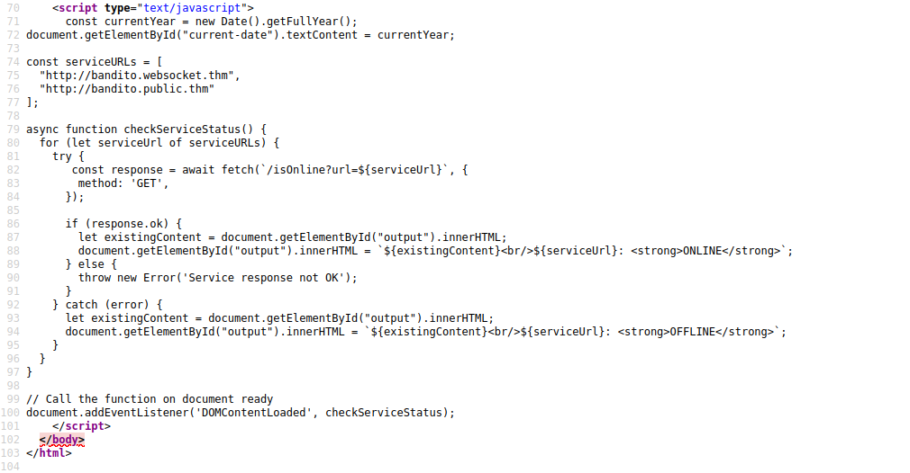

From the source code, I found the /isOnline?url= endpoint, which could be used for ssrf.

Using this code to set up my websocket, I was able to make the connection with the server

```python
import sys
from http.server import HTTPServer, BaseHTTPRequestHandler

if len(sys.argv)-1 != 1:
    print("""
Usage: {} <port_number> 
    """.format(sys.argv[0]))
    sys.exit()

class Redirect(BaseHTTPRequestHandler):
   def do_GET(self):
       self.protocol_version = "HTTP/1.1"
       self.send_response(101)
       self.end_headers()

HTTPServer(("", int(sys.argv[1])), Redirect).serve_forever()
```

With this setup, I could access the /admin-creds endpoint

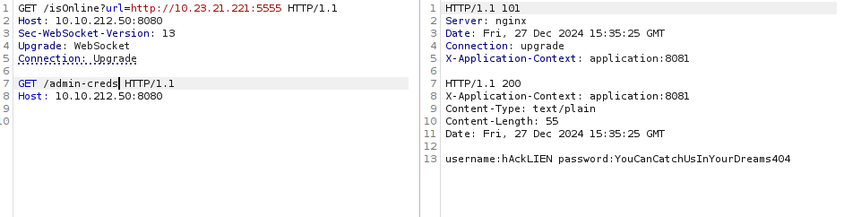

Here's the request to get the flag

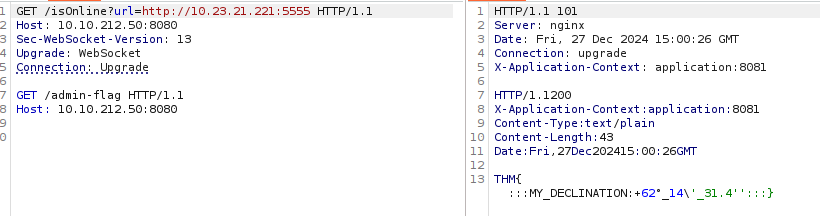

# The second flag

Coming back on the server on the port 80.
There was nothing on the main page except a javascript file in the source code.
This script sumulates a chat between two users JACK and OLIVER.

```js
document.addEventListener("DOMContentLoaded", function () {
	const discussions = document.querySelectorAll(".discussion");
	const messagesChat = document.querySelector(".messages-chat");
	const headerName = document.querySelector(".header-chat .name");
	const writeMessageInput = document.querySelector(".write-message");
	let userMessages = {
		JACK: [],
		OLIVER: [],
	};

	// Function to fetch messages from the server
	function fetchMessages() {
		fetch("/getMessages")
			.then((response) => {
				if (!response.ok) {
					throw new Error("Failed to fetch messages");
				}
				return response.json();
			})
			.then((messages) => {
				userMessages = messages;
				userMessages.JACK === undefined
					? (userMessages = { OLIVER: messages.OLIVER, JACK: [] })
					: userMessages.OLIVER === undefined &&
					  (userMessages = { JACK: messages.JACK, OLIVER: [] });

				displayMessages("JACK");
			})
			.catch((error) => console.error("Error fetching messages:", error));
	}

	// Function to display messages for the selected user
	function displayMessages(userName) {
		headerName.innerText = userName;
		messagesChat.innerHTML = "";
		userMessages[userName].forEach(function (messageData) {
			appendMessage(messageData);
		});
	}

	// Function to append a message to the chat area
	function appendMessage(messageData) {
		const newMessage = document.createElement("div");
		console.log({ messageData });
		newMessage.classList.add("message", "text-only");
		newMessage.innerHTML = `
           ${messageData.sender !== "Bot" ? '<div class="response">' : ""}
        <div class="text">${messageData}</div>
    ${messageData.sender !== "Bot" ? "</div>" : ""}
        `;
		messagesChat.appendChild(newMessage);
	}

	// Function to send a message to the server
	function sendMessage() {
		const messageText = writeMessageInput.value.trim();
		if (messageText !== "") {
			const activeUser = headerName.innerText;
			const urlParams = new URLSearchParams(window.location.search);
			const isBot =
				urlParams.has("msg") && urlParams.get("msg") === messageText;

			const messageData = {
				message: messageText,
				sender: isBot ? "Bot" : activeUser, // Set the sender as "Bot"
			};
			userMessages[activeUser].push(messageData);
			appendMessage(messageText);
			writeMessageInput.value = "";
			scrollToBottom();
			console.log({ activeUser });
			fetch("/send_message", {
				method: "POST",
				headers: {
					"Content-Type": "application/x-www-form-urlencoded",
				},
				body: "data="+messageText
			})
				.then((response) => {
					if (!response.ok) {
						throw new Error("Network response was not ok");
					}
					console.log("Message sent successfully");
				})
				.catch((error) => {
					console.error("Error sending message:", error);
					// Handle error (e.g., display error message to the user)
				});
		}
	}

	// Event listeners
	discussions.forEach(function (discussion) {
		discussion.addEventListener("click", function () {
			const userName = this.dataset.name;
			console.log({ userName });
			displayMessages(userName.toUpperCase());
		});
	});

	const sendButton = document.querySelector(".send");
	sendButton.addEventListener("click", sendMessage);
	writeMessageInput.addEventListener("keydown", function (event) {
		if (event.key === "Enter") {
			event.preventDefault();
			sendMessage();
		}
	});

	// Initial actions
	fetchMessages();
});

// Function to scroll to the bottom of the messages chat
function scrollToBottom() {
	const messagesChat = document.getElementById("messages-chat");
	messagesChat.scrollTop = messagesChat.scrollHeight;
}


```

When trying to access any of the endpoints, you are shown this login page.

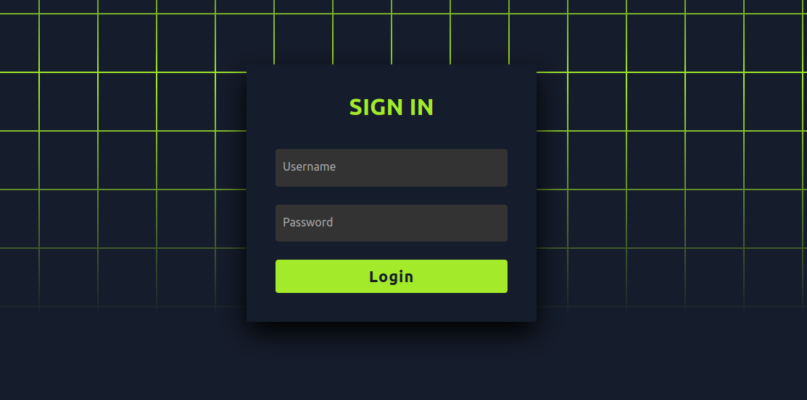

This was where the previously harvested credentials proved to be useful.
The chat looked like this:

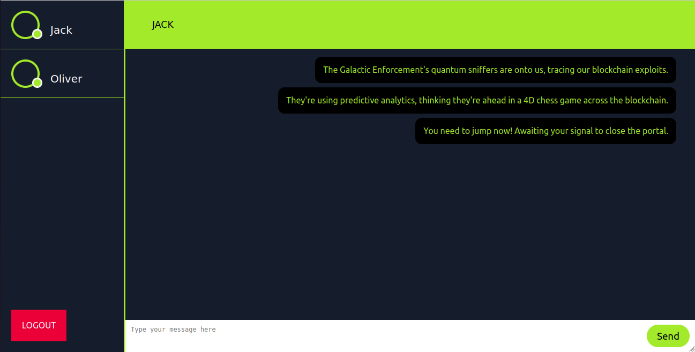

By inspecting the request headers in the network tab of the browser console, I noticed that the proxy uses the HTTP/2 protocol.
Since this is a chall on smuggling attack, I decided to try downgrading the protocol to HTTP/1.1.
From the js code, I knew that there was a bot with access to other content than mine.
The goal was to, when the bot arrives on the page, make it send the content of its page to the chat by using `/send_message`.

To achieve this, I needed to make a POST request to `/messages` with a content-length of 0 to tell the proxy that the sent payload is empty.
This tricks the proxy into executing whatever comes after.
In the same request, I wrote the POST request to `/send_message` with an arbitrary content-length matching the size of the page content, this request will be queued just after the legitimate one.

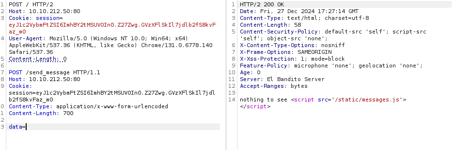

Waited a few minutes without making any request then I retrieved the flag.

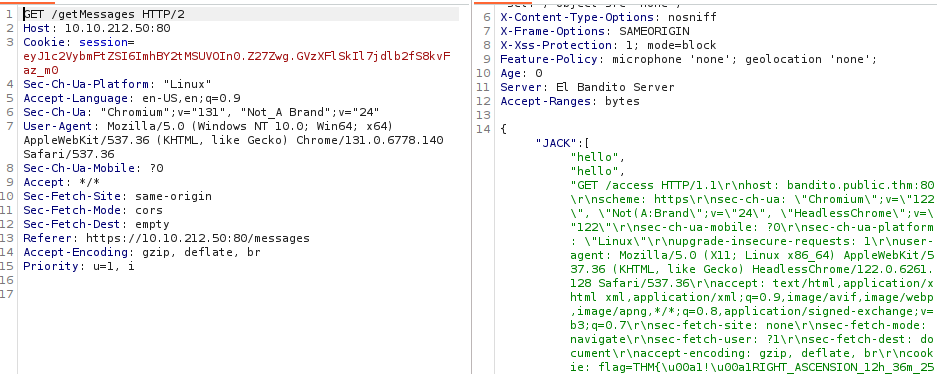


