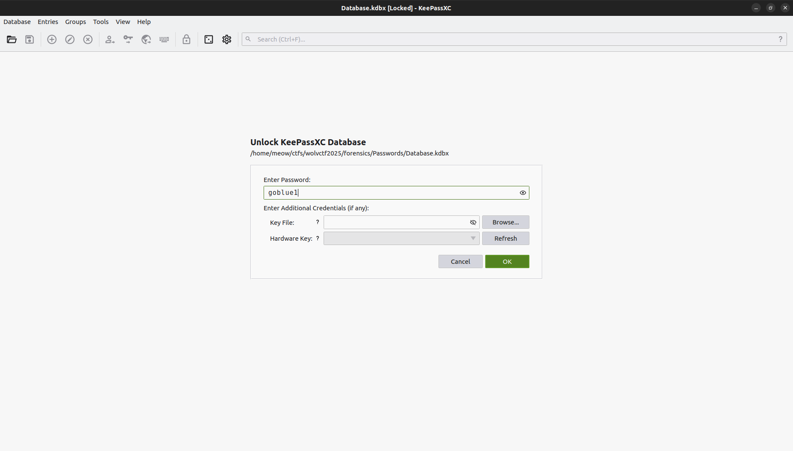
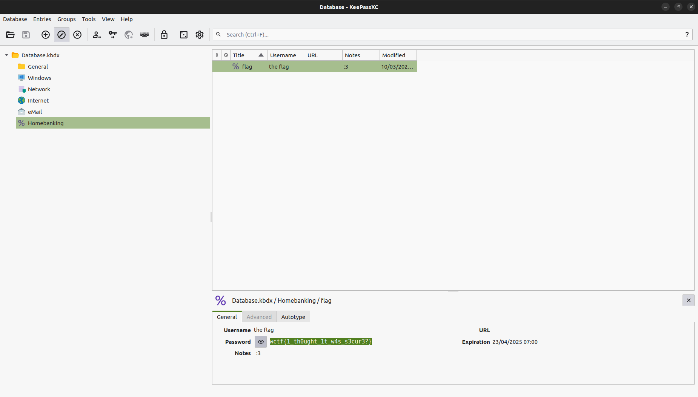

# Passwords

We are prodided a keepass database as a file. First thing to try is to acess it by trying an empty password which of course didn't work. Brute-forcing the password was required to access the database.

I converted the file into a hash using john tool:

`keepass2john Database.kdbx > hash`

`$keepass$*2*6000*0*5bd85bff1c654df5d8cb8f64b877ea179b66978615917c39faf6edd98444928b*dec1f1a8a46d2257b1c536800ccea618d15523c983162f1a760d0f0e3f32bed6*02dc62f9e295c9a256e4e231b3102c1a*8ed6478291ac58151a98e7465f10a11e8cafc1706d048ef4f94fe51453f091bc*193dd9a5673c4a3f5b33dd59639f27760f03285044f14eacc652f4a441b45413`

Then using hashcat

`hashcat -a 0 -m 13400 hash rockyou.txt`

`hashcat -a 0 -m 13400 hash rockyou.txt --show`

`$keepass$*2*6000*0*{REDACTED}:goblue1`

At last, using `KeePassXC`, I retrieved the content of the db.

