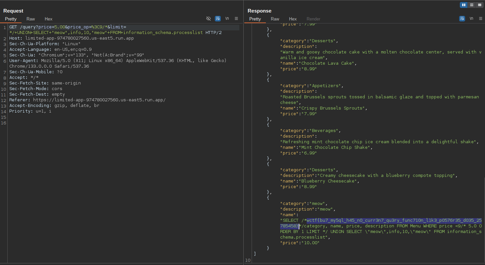
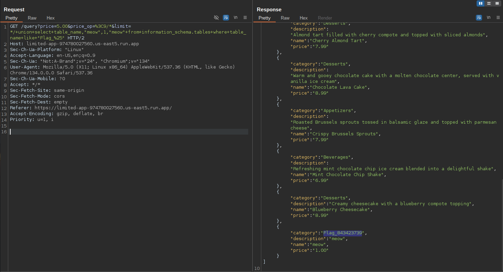
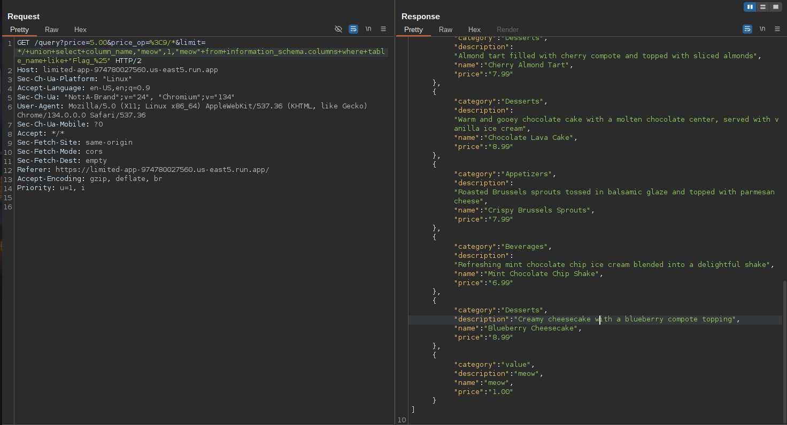
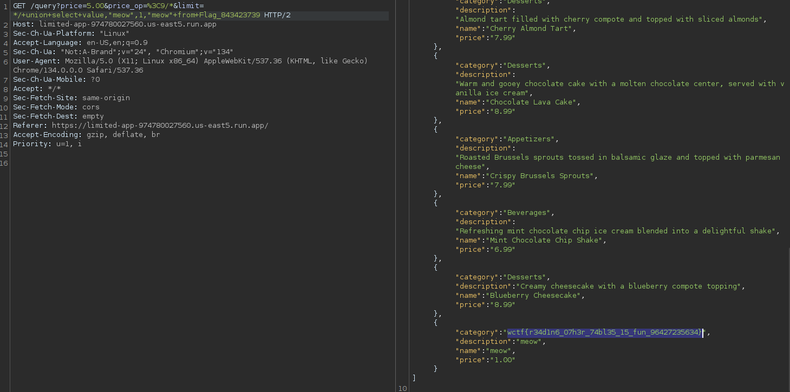
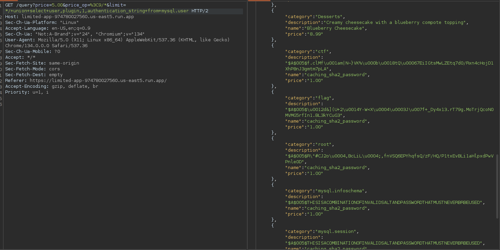

The goals of these challenges were to exploit an sql injection to retrieve the different flags hidden in the application. The provided source code is the same for the 3 challenges.

Here is a sample of the code, this is where lie the vulnerability

```python
#{REDACTED}
    price_op = str(request.args.get('price_op') or '>')
    if not re.match(r' ?(=|<|<=|<>|>=|>) ?', price_op):
        return 'price_op must be one of =, <, <=, <>, >=, or > (with an optional space on either side)', 400

    # allow for at most one space on either side
    if len(price_op) > 4:
        return 'price_op too long', 400

    # I'm pretty sure the LIMIT clause cannot be used for an injection
    # with MySQL 9.x
    #
    # This attack works in v5.5 but not later versions
    # https://lightless.me/archives/111.html
    limit = str(request.args.get('limit') or '1')

    query = f"""SELECT /*{FLAG1}*/category, name, price, description FROM Menu WHERE price {price_op} {price} ORDER BY 1 LIMIT {limit}"""
    print('query:', query)

    if ';' in query:
        return 'Sorry, multiple statements are not allowed', 400
#{REDACTED}
```

There was 3 inputs that could be sent thought the application. I am not going to pay attention to the third one because it needs to be an int. 

What caught my eyes, was the regex comparison for the second input. It is only checking wether one of the following comparison `=|<|<=|<>|>=|>` is inside the string. Meaning that if we add other characters next to a `<`, for example, it will still be valid. On top of that, we are limited to a 4 characters length input but it doesn't mitigate the original vulnerability. Next up is the query `SELECT /*{FLAG1}*/category, name, price, description FROM Menu WHERE price {price_op} {price} ORDER BY 1 LIMIT {limit}`, all made sense from this query. Just in case, I tried to execute other sql queries by only exploiting the `limit` variable but it didn't work. Then I decided that I just needed to get rid of the `LIMIT` keyword. How ? By exploiting the price_op variable. I said that we could write anything next to a valid character and by anything, it could be simply a comment. 

The query would look like so:

`SELECT /*{FLAG1}*/category, name, price, description FROM Menu WHERE price <9/* ORDER BY 1 LIMIT */ HERE STARTS THE FUN`

# Limited1

I could see from the code that the first flag was inside the query itself, meaning I had to retrive the current processed queries from the mysql database. To achieve this, there is table from `information_schema` that contains all queries that are being processed `processlist`. By using the exploit I found, I manage to retrieve the first flag:



# Limited2 

The second flag was hidden inside another table inside the database:

```sql
-- The actual name of this table in the host challenge starts with Flag_ but is unguessable.
CREATE TABLE Flag_REDACTED
(
    value VARCHAR(255) NOT NULL
);

INSERT INTO Flag_REDACTED (value) VALUES ('wctf{redacted-flag}');
```

The methodology to retrieve it is to first retrive the different tables of the database, then its column names and lastly, the flag.







# Limited 3

This one gave a struggle to everyone at the start of the competition. The goal was to retrieve the password of a user of the database. In the description, it was said the password were 13 characters long and in `rockyou.txt`.

I needed 2 things to crack the password, the hash and the plugin used to make the hash. This information could be found in the `mysql.user` table, however I needed to make a change in the format of the hash if I wanted to crack it with `hashcat` because the format `hashcat` accepts is different from the hash we get. 



I found this article on how to get the correct format https://www.percona.com/blog/brute-force-mysql-password-from-a-hash/ which help me crack the password.

This the hash I retrieved `$mysql$A$005*1264265D28552B3214592D573C5804034A7F2B5F*4479347831332E72543739672E4D6F54726A51636F4E304D564D47357266496E312E424C336B5943754733`. But before cracking it I needed to generate a new wordlist.

`grep -o '\b\w\{13\}\b' rockyou.txt > passwords`

Using hashcat:

```
hashcat -a 0 -m 7401 hash passwords --show
$mysql$A$005*1264265D28552B3214592D573C5804034A7F2B5F*4479347831332E72543739672E4D6F54726A51636F4E304D564D47357266496E312E424C336B5943754733:maricrissarah
```

And there's the password which mean that the flag is `wctf{maricrissarah}`
